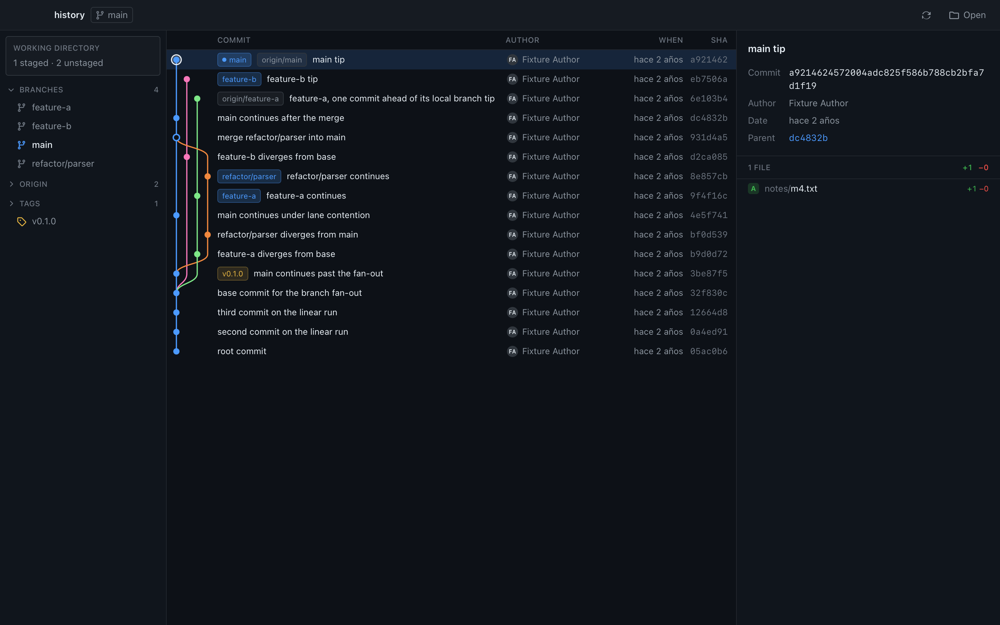

<h1 align="center">Gitvisor</h1>

<p align="center">
  A visual git client for macOS, Windows and Linux.<br>
  See your branches, merges and history as a graph — not as a wall of <code>git log</code>.
</p>

<p align="center">
  <a href="#license"></a>
  
  
</p>

<p align="center"><a href="README.md">Español</a> · <b>English</b></p>



<sub>The screenshot shows the deterministic test fixture, so the same history renders identically on every machine.</sub>

---

## Status: early, and honest about it

Gitvisor **reads** repositories today. It does not write to them yet.

| | |
|---|---|
| ✅ Works | Commit graph, branches, remotes, tags, commit detail, working-directory status |
| 🚧 Not yet | Stage, commit, branch, checkout, fetch, pull, push |
| ❌ Not planned | Rebase, cherry-pick, force-push, visual conflict resolution — [see why](#scope-what-gitvisor-will-and-will-not-do) |
| 🧪 Verified on | macOS. Windows and Linux are supported by the stack but not yet exercised |

Do not point it at a repository you cannot afford to lose — not because it writes
(it does not), but because it is young.

## Quick start

You need [Rust](https://rustup.rs), [Node](https://nodejs.org) and [pnpm](https://pnpm.io).

```bash
git clone https://github.com/fabricastro/gitvisor
cd gitvisor
pnpm install

pnpm app          # run in development
pnpm app:build    # build an installer for your platform
```

Open a repository with **⌘O**, or launch straight into one:

```bash
gitvisor /path/to/repo
```

## Scope: what Gitvisor will and will not do

Gitvisor aims at **the daily loop, minus the operations that can destroy work.**

Reading, staging, committing, branching and syncing are in scope. Rebase,
cherry-pick, force-push and visual conflict resolution are deliberately out.

The reasoning is simple: a defect in anything in scope shows wrong pixels or
refuses an action. A defect in `rebase` silently destroys someone's history, and
git's whole value is being deterministic and auditable. That trade is recorded,
with its rationale, in [`openspec/config.yaml`](openspec/config.yaml).

Out of scope means *deferred pending a deliberate decision*, not *never*.
Ideas waiting their turn live in [`openspec/backlog.md`](openspec/backlog.md).

## Architecture

```
crates/git-core/     Domain. Reads the repository, computes the graph layout.
                     Knows nothing about Tauri, HTTP, or any UI.
src-tauri/           Desktop shell. Thin commands over git-core. No logic.
src/                 React UI, organised by feature.
tools/git-fixtures/  Deterministic repositories for the test harness.
```

Everything that understands git is Rust. Everything that understands pixels is
TypeScript. They meet at a narrow set of commands, and `git-core` has no idea a
UI exists — which is what makes the domain testable without a window.

### The interesting part: lane layout

The hard problem in a client like this is not the window. It is deciding **which
horizontal lane each commit belongs to**, so a long-lived branch draws as one
straight line instead of wandering across the screen.

[`crates/git-core/src/graph.rs`](crates/git-core/src/graph.rs) solves it in two
passes:

1. **Place** every commit. Each lane holds the id of the commit it is waiting
   for; when that commit arrives it takes the lane, and its first parent keeps
   the line going. Extra parents of a merge branch off onto their own lane.
2. **Connect** them — only now, with every commit's final lane known, are edges
   emitted.

Doing both in one pass looks simpler and is subtly wrong: an edge gets emitted
before its parent's lane is decided, so a side branch that claims a lane first
drags the main line sideways for the rest of the graph. There is a regression
test named after exactly that.

The UI then draws rows, never the DAG. Commit text is virtualised DOM so it stays
selectable; the lines behind it are one canvas that repaints on scroll.

## Testing

```bash
cargo test --workspace       # domain, graph layout, fixture determinism
pnpm build                   # typecheck and bundle
pnpm run e2e:build           # build the e2e binary with the frontend embedded
pnpm e2e:native:smoke        # drives the real app in real WKWebView
pnpm e2e:native:regressions
pnpm e2e:browser             # the same frontend, in Chrome, against generated mocks

# Rebuild the deterministic fixture and regenerate e2e/mocks/*.json from it.
# Run this after changing anything under crates/git-core/src/model.rs — CI
# fails the build if the committed mocks drift from what this produces.
pnpm run e2e:mocks

# Print the computed graph as ASCII for any repository — the fastest way to
# check a layout change. Run it beside `git log --graph --oneline --all`.
cargo run -p git-core --example dump -- /path/to/repo
```

The end-to-end suite launches the **actual binary** and drives the **actual
webview** through WebDriver, so what it verifies is what users get. The embedded
WebDriver server is compiled out of every non-`e2e` build by a Cargo feature, a
`build.rs` capability gate and a `compile_error!` guard — enabling it in a
release build fails to compile rather than shipping a remote-control surface.
Release builds are additionally checked by `scripts/release-scan.sh`, which
scans the shipped bundle for any trace of the plugin and asserts both that it's
absent from the release artifact and present in a deliberately e2e-enabled
one — so a check that quietly stopped matching can't pass by accident.

Browser mode (`pnpm e2e:browser`) drives the same frontend in Chrome against
`invoke()` mocks generated straight from the fixture through the same
`git-core` types the app itself uses — never hand-authored, and diff-checked
in CI. It needs no Rust build and no WebKit, so it's the fast iteration loop;
the native suite above is the correctness authority, since browser mode can't
see real WebKit rendering, real IPC or the capability system.

Fixtures pin author identity, timestamps, branch names and tree content, and
assert commit OIDs against hardcoded constants, so the same history renders
identically everywhere. Note that determinism stops at the object IDs: the UI
renders *relative* dates, so rendered text is a function of today's date. Never
assert on it.

## How this project is built

Substantial changes go through a spec-driven workflow before any code is
written. Proposals, specs, designs and task breakdowns are committed under
[`openspec/`](openspec/) — including the reasoning that was **rejected** and why.

If you want to know why something is the way it is, that directory is the answer,
and it is deliberately part of the repository rather than someone's private
notes.

## Contributing

Contributions are welcome, especially:

- **Windows and Linux verification** — the stack supports both; nobody has run it there yet.
- **Write operations** — the in-scope list above is unclaimed.
- **Graph layout edge cases** — octopus merges, very wide histories, shallow clones.

Before opening a pull request:

1. `cargo test --workspace && cargo clippy --workspace --all-targets && cargo fmt --all --check`
2. `pnpm build`
3. If you touched the graph, run the `dump` example beside `git log --graph` and compare.

For anything larger than a bug fix, open an issue first so the scope decision
happens before the code does.

## Roadmap

- [ ] Diff viewer for individual files
- [ ] Stage, unstage and commit from the UI
- [ ] Branch and checkout
- [ ] Fetch, pull and push
- [ ] Search across history
- [ ] Blame and branch comparison
- [ ] Light theme

## License

MIT — see [LICENSE](LICENSE).
