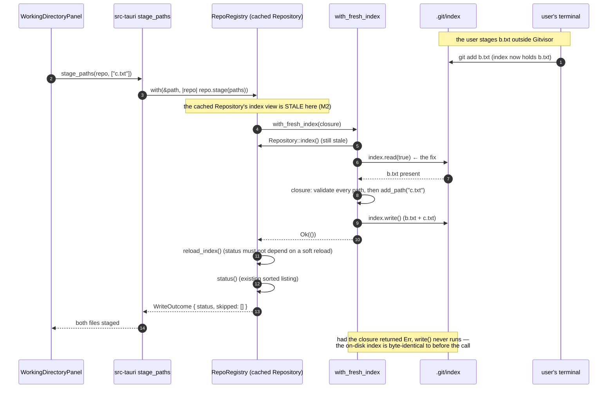
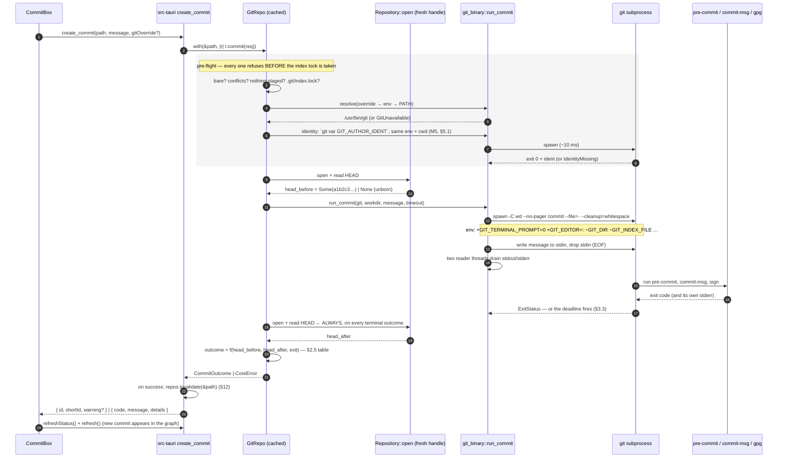

# Design: stage-and-commit

Staging is libgit2 through **one** index handle that nothing else can obtain. Committing is the user's own
`git` binary, run as a plain subprocess, with its outcome **derived from observed HEAD movement rather than
from its exit code**. Every other decision here follows from those two sentences.

The proposal decided *what*. This document decides *how*, and — where the proposal left an item unverified —
either measures it, or removes the design's dependency on it.

Scope reminder: file-level stage/unstage/commit, plus stage-all/unstage-all over a caller-supplied list.
No amend, no hunks, no discard, no branch, no remote.

---

## The principle this document applies repeatedly

> **When a claim is unverified, prefer removing the dependency on it over resolving it.**

A measurement answers a question *today*, on *one platform*. A structure answers it for every future
contributor. Four times in this design the cheaper move was to stop needing the answer:

| Unverified claim | Design's response |
|---|---|
| Does a cached `Repository` observe an external HEAD move? (`measurements.md` §Still unverified) | Post-write HEAD is read from a **freshly opened** `Repository`. The question stops being load-bearing (§2.4) |
| What `git2::ErrorCode` does a locked index produce? (`explore.md` §3.8) | Check for `.git/index.lock` **ourselves** before mutating. The libgit2 code is never consulted (§5.4) |
| Does libgit2 honour `:(literal)` pathspec magic? | Unstage uses no pathspec API at all — index entries are restored one literal path at a time (§8) |
| Does `@wdio/tauri-service` re-spawn the app per spec file? | Write specs get their **own wdio config**, the same shape as the existing native/browser split. Zero unknowns (§9.3) |
| What is git's exact author-identity precedence? (`explore.md` §3.3 answered this confidently and **wrongly** — M5) | Never re-derive it. Ask the same `git` binary that will perform the commit, via `git var GIT_AUTHOR_IDENT` (§5.1) |

Where a dependency genuinely cannot be removed — the pinentry hang — it was measured (M3), and §3 states
precisely which part of M3 the design leans on and which part it refuses to generalise.

---

## Decision summary

Read this table first. Everything below is the mechanism and the evidence.

| # | Question | Decision | Confidence |
|---|---|---|---|
| **A1** | How is `with_fresh_index()` made the *only* index handle? | Three layers: crate privacy (compiler, real), `clippy.toml` `disallowed-methods` + crate-level `deny` (mechanical, one auditable `#[allow]`), and an M2 regression test. **Rust visibility alone does not carry it** — §1.2 says exactly why | Mechanism decided; clippy path resolution **unverified** (U3) |
| **A2** | Closure or returned `Index`? | Closure: `with_fresh_index(|idx| …)`. `read(true)` before, `write()` **only on the success path** — so a refusal inside the closure structurally cannot reach disk | **Verified** — Rust semantics |
| **A3** | Commit argv | `<git> -C <workdir> --no-pager commit --file=- --cleanup=whitespace`, message on **stdin** | Decided, §2.1 |
| **A4** | Commit outcome source | **Observed HEAD delta**, always. Exit code only chooses the message | Decided, §2.4 — the core safety property |
| **A5** | Hang guard | Bounded timeout, **required not prudent** (M3: `GIT_TERMINAL_PROMPT=0` is not a hang guard). SIGTERM → 5 s grace → SIGKILL, matching the signal M3 actually measured | M3-backed; grandchild reaping **unverified** (U2) |
| **A6** | Timeout reporting | Post-timeout HEAD read decides the message. M3 says the measured hang point yields "did not commit"; the design **observes** that rather than assuming it | Decided, §3.2 |
| **A7** | `git` resolution | Per invocation, never cached: explicit override → `GITVISOR_GIT_PATH` → `PATH` (via the `which` crate). Validated by `--version` **in the probe only** | Decided, §4 |
| **A8** | Error wire shape | `{ code, message, details? }`. `message` is byte-identical to today's string for the existing three variants, so the seven existing commands' UX is provably unchanged | **Verified** by construction, §5.2 |
| **A9** | Path safety | Normalise-and-reject-escapes in `git-core` **before** `add_path`; libgit2's own refusal (M4) kept as a deliberate, documented backstop. Reject escapes, not `..` | M4-backed, §6 |
| **A10** | Stage all / unstage all | Same command, `paths: &[String]`. One `with_fresh_index` per batch ⇒ one atomic index write. Vanished paths are **skipped and reported**, not a batch failure | Decided, §7 |
| **A11** | Unstage mechanism | Manual index-entry restoration from the HEAD tree. **No** `reset_default`, no `checkout_*`, no pathspec. Enforced by the same clippy gate | Decided, §8 |
| **A12** | Fixtures | `build-fixture --name` selects a **recipe**, not just a directory. Exactly **two** fixtures (`history`, `writes`) — D8 collapsed the native surface to one spec | Decided, §9 — corrects `explore.md` §3.7 |
| **A13** | Author identity | `git var GIT_AUTHOR_IDENT`, same binary / env / cwd as the commit. `Repository::signature()` is **denied by lint**. No prospective author is displayed anywhere | **M5-measured** — libgit2 and `git` disagree in *both* directions. Corrects `explore.md` §3.3, which marked the opposite claim "Verified", §5.1 |

---

## Architecture at a glance

### Component map

```
┌─ frontend ──────────────────────────────────────────────────────────────┐
│ src/features/working-directory/   NEW  panel: staged / unstaged / commit │
│ src/features/repo/api.ts          +4 invoke wrappers                     │
│ src/features/repo/store.ts        +refreshStatus(), describe() → wire     │
└──────────────────────────────────────────────┬──────────────────────────┘
                                               │ invoke() — one chokepoint
┌─ src-tauri (thin) ────────────────────────────▼─────────────────────────┐
│ commands.rs   stage_paths · unstage_paths · create_commit · git_probe    │
│ state.rs      +invalidate(path)  — drop the cached handle after a commit │
└──────────────────────────────────────────────┬──────────────────────────┘
                                               │ &GitRepo
┌─ crates/git-core (domain) ────────────────────▼─────────────────────────┐
│ repo.rs         stage · unstage · commit · probe   (orchestration only)  │
│ index_guard.rs  NEW, private:  with_fresh_index · reload_index          │
│                 ── the only two call sites of Repository::index() ──     │
│ paths.rs        NEW, pure: normalise_repo_path()  (no I/O, unit-tested)  │
│ git_binary.rs   NEW: resolve · probe · run_commit (Command, timeout)     │
│ error.rs        +9 refusal variants, code(), {code,message,details?}     │
│ model.rs        +WriteOutcome · CommitOutcome · GitProbe                 │
└─────────────────────────────────────────────────────────────────────────┘
```

### Boundary compliance (`rules.design`)

| Rule | How this design honours it |
|---|---|
| Domain logic stays in `git-core` | Every refusal, every path rule, the subprocess contract, and the exit→error mapping live in `git-core` and are reachable by `cargo test -p git-core` — the project's only real test runner |
| `src-tauri` only exposes thin commands | Each new command is one `repos.with(&path, …)` line, plus one `repos.invalidate(&path)` after a successful commit. No branching, no validation, no message building |
| No Tauri/React imports in `git-core` | Unchanged. New deps are `which` and (Unix-only) `libc` — neither is a UI or transport concern; §4.3 and §3.3 justify each |
| Sequence diagrams for complex flows | §1.6 (stage + index refresh), §2.6 (commit) |
| Sorted `status()` invariant (D9) | Every write returns a `WorkingStatus` produced by the **existing** `status()`. `WriteOutcome.skipped` is the only new list and is sorted at construction |

### Which layer owns the subprocess, and why

**`git-core` owns it.** Not `src-tauri`.

`std::process::Command` is standard library, not a Tauri surface — it needs no capability, no plugin, no
permission entry. The question is therefore not "is this allowed in the domain crate" but "where does the
decision live". Three reasons it is the domain:

1. **It *is* the domain decision.** "A commit in Gitvisor means what a commit in your terminal means" is a
   product rule about the meaning of a commit, and the exit→refusal mapping is that rule's implementation.
2. **Testability.** `cargo test -p git-core` is the only runner this project has. Splitting the commit
   across two crates would put the hook-rejection proof, the timeout proof, and the HEAD-delta proof
   somewhere with no test runner at all.
3. **The boundary rule is about UI and transport**, not about process isolation. `git-core` already links
   vendored libgit2, which opens files, spawns nothing, but is every bit as much "the outside world".

`src-tauri` keeps exactly one new responsibility that is genuinely its own: **cache lifecycle** (§12).

---

## 1. The index guard (open question 1)

### 1.1 Shape

```rust
// crates/git-core/src/index_guard.rs  —  private module, two functions, nothing else.

impl GitRepo {
    /// The only way a write path obtains an index.
    ///
    /// M2 (`measurements.md`): a `Repository` held open by `RepoRegistry` returns a
    /// STALE index after an external `git add`. Mutating that index and writing it
    /// back DESTROYS the user's staging. `read(true)` below is the fix, and this
    /// helper exists so no future write method has to remember it.
    ///
    /// DO NOT delete this indirection. DO NOT add a variant that returns the
    /// `Index` to the caller. See design.md §1.
    #[allow(clippy::disallowed_methods)] // the one sanctioned Repository::index() call site
    pub(crate) fn with_fresh_index<T>(
        &self,
        mutate: impl FnOnce(&Repository, &mut Index) -> Result<T>,
    ) -> Result<T> {
        let mut index = self.inner.index()?;
        index.read(true)?;                     // M2
        let out = mutate(&self.inner, &mut index)?;
        index.write()?;                        // success path only — see 1.5
        Ok(out)
    }

    /// Force the repository's own index view back in sync with disk, without
    /// writing. Used before recomputing `status()` after a write, so the returned
    /// listing never depends on libgit2's mtime-based soft reload.
    #[allow(clippy::disallowed_methods)]
    pub(crate) fn reload_index(&self) -> Result<()> { … }
}
```

`read(true)` — hard, not soft. A soft reload compares mtime/size, and mtime granularity can hide a
same-second external write. The cost is re-parsing a file that is a few kilobytes in any repository a human
works in daily; it is paid once per write command, and it buys the removal of an entire class of race.

### 1.2 What Rust enforces, and what it does not — stated plainly

**Enforced by the compiler, no test needed:** `GitRepo.inner` is a private field with no accessor. Nothing
outside `crates/git-core::repo` can obtain an `Index` at all — not `src-tauri`, not `tools/git-fixtures`,
not an integration test, not a future crate. The blast radius is one module.

**Not enforced by the compiler:** inside that module, a new method on `impl GitRepo` can write
`self.inner.index()` and get an unrefreshed handle. **Rust's visibility rules are module-granular; private
means private *to the module*, not private *to one function*.** There is no `pub(in self::fn)`.

Three escapes were considered and rejected:

| Attempt | Why it fails |
|---|---|
| Move `Repository` into a sub-module newtype exposing only `with_fresh_index` | The five existing read methods need `&Repository`, and `&Repository` has `.index()`. Handing it out re-opens the hole; wrapping all five reads is a large refactor of untouched, working code for no read-path benefit |
| Split writes into `repo/writes.rs` so the field is not visible there | The field would need `pub(in crate::repo)` to be usable, which restores module-wide visibility |
| Never store `Repository`; reopen per call | Deletes the `RepoRegistry` cache the project deliberately built (`state.rs` doc comment). Also does not stop a future contributor calling `.index()` on the freshly opened handle |

So the guarantee is completed by a lint, not by the type system. Say so out loud rather than implying the
compiler has it covered.

### 1.3 The mechanical gate

New file at the workspace root:

```toml
# clippy.toml
disallowed-methods = [
  # The index-freshness invariant (M2 / design.md §1). Obtain an index only
  # through GitRepo::with_fresh_index, which calls read(true) first.
  { path = "git2::Repository::index",       reason = "use GitRepo::with_fresh_index (M2: stale index destroys external `git add`)" },
  { path = "git2::Index::open",             reason = "use GitRepo::with_fresh_index" },
  # Unstage is index-only. These reach the working tree (proposal §7 risk 2).
  { path = "git2::Repository::reset",       reason = "unstage is index-only; restore the HEAD tree entry instead" },
  { path = "git2::Repository::reset_default", reason = "takes pathspecs, which glob; see design.md §8" },
  { path = "git2::Repository::checkout_head",  reason = "would overwrite uncommitted work" },
  { path = "git2::Repository::checkout_tree",  reason = "would overwrite uncommitted work" },
  { path = "git2::Repository::checkout_index", reason = "would overwrite uncommitted work" },
  # Stage exactly what the user pointed at (proposal §7 risk 3).
  { path = "git2::Index::add_all",    reason = "stage the listed paths, never a glob" },
  { path = "git2::Index::remove_all", reason = "unstage the listed paths, never a glob" },
  { path = "git2::Index::update_all", reason = "stage the listed paths, never a glob" },
  # Author identity (M5 / design.md §5.1). libgit2 reads config only; `git`
  # honours GIT_AUTHOR_*. The two were MEASURED disagreeing in both directions.
  { path = "git2::Repository::signature", reason = "identity comes from `git var GIT_AUTHOR_IDENT`, not libgit2 (M5)" },
]
```

and in `crates/git-core/src/lib.rs`:

```rust
#![deny(clippy::disallowed_methods)]
```

Why crate-level `deny` rather than `-D warnings` in CI: it travels with the crate, it fires in a
contributor's editor before CI, and it does not raise global strictness for the whole workspace as a side
effect. `clippy::` tool lints are accepted and ignored by plain `rustc`, so this does not affect
`cargo build`. The existing verify command (`cargo clippy --workspace --all-targets`) already runs it.

Two sanctioned exemptions, each an `#[allow]` with a comment — greppable, reviewable, and impossible to add
silently:

- `index_guard.rs` — the two `Repository::index()` call sites above.
- `tools/git-fixtures/src/lib.rs:134` — `checkout_head` + `CheckoutBuilder::force`. Writing a working tree
  is that binary's entire job; it builds throwaway fixtures, never a user repository.

> **U3 — unverified.** Whether `clippy.toml`'s `disallowed-methods` resolves paths to *inherent methods of a
> foreign type* (`git2::Repository::index`) has not been run here. **Cheap check (5 min):** add the
> `clippy.toml`, add a throwaway `let _ = self.inner.index();` in `repo.rs`, run
> `cargo clippy -p git-core`, confirm it errors, delete the line. If path resolution does not work, fall
> back to a `crates/git-core/tests/index_discipline.rs` source-scan test asserting `.index()` appears in
> exactly one file — the same technique the harness change uses for its release-artifact byte scan
> (`visual-verification-harness/design.md` §1.3), for the same reason: a convention that is not a build
> failure is a comment.

### 1.4 The behavioural guarantee

The lint stops the *mechanism* from being bypassed. A test proves the *effect*, so a future refactor that
satisfies the lint by other means still fails if it reintroduces M2:

```
crates/git-core/tests/index_freshness.rs
  M2 replay:  create repo · commit A · write b.txt and c.txt
              external `git add b.txt`  (real subprocess, not an in-process index write)
              GitRepo::stage(["c.txt"])
              assert status().staged == ["b.txt", "c.txt"]   ← both survive
```

The external `git add` must be a real subprocess. An in-process `index.add_path` would share libgit2's
in-memory state and would not reproduce the measured condition — the same "positive control" discipline the
hook experiment used (`explore.md` §Orchestrator verification).

### 1.5 A property the closure gives for free

`write()` is on the success path only. If `mutate` returns `Err` — an unsafe path, a conflicted entry, a
libgit2 refusal on entry 7 of 20 — **the index on disk is untouched.** "Refuse before mutating anything"
(proposal D2) is therefore not a discipline the implementer must maintain for staging; it is what the helper
does. Batch operations inherit it: twenty paths, one `write()`, all-or-nothing (§7).

### 1.6 Sequence — stage, with the M2 interleaving



---

## 2. The commit subprocess (open question 2)

### 2.1 Exact argv

```
<resolved-git-absolute-path>
  -C <workdir-absolute>
  --no-pager
  commit
  --file=-
  --cleanup=whitespace
```

| Token | Why |
|---|---|
| absolute resolved path, never the bare string `git` | The probe and the commit must agree on the same binary. `Command::new("git")` would do its own `PATH` search, which can differ from the probe's (§4) |
| `-C <workdir>` | Repository selection independent of any inherited cwd |
| `--no-pager` | A configured `core.pager` on a piped stdout is a hang waiting to happen |
| `--file=-` | Message on **stdin**: no argv-size ceiling, and the message never appears in the process table where every user on the machine can read it via `ps` |
| `--cleanup=whitespace` | Explicit, not inherited from `commit.cleanup`. Strips trailing whitespace and leading/trailing blank lines; **does not** strip `#` lines, so a message beginning `#123 fix login` survives |

**Never passed, at any time, for any reason:** `--no-verify` (the entire point of shelling out is that hooks
run), `-a`, `--amend`, `--allow-empty`, `-S` / `--no-gpg-sign` (signing is the user's config to decide, per
M1 + D1), `-m` (see `--file=-`), any pathspec. A `--` terminator is unnecessary because no positional
argument is ever passed.

Nothing is ever routed through a shell. `Command::new(path).args([…])` passes argv directly; there is no
`sh -c`, no string interpolation, and therefore no quoting question to get wrong.

### 2.2 Exact environment

**Start from the inherited environment.** Clearing it would break precisely what shelling out exists to
preserve: `HOME`, `GNUPGHOME`, `SSH_AUTH_SOCK`, `PATH` (hooks call other tools), `NVM_*`/`PATH` entries a
husky hook needs, and the user's locale.

Then three edits:

| Action | Variable | Reason |
|---|---|---|
| **set** | `GIT_TERMINAL_PROMPT=0` | Closes git's *own* credential prompt path. **M3 measured that this is not a hang guard** — it has no effect on a blocking `gpg.program`. It is kept because it is free and closes one real path; it is never presented as the hang mitigation. §3 owns that |
| **set** | `GIT_EDITOR=:` and `GIT_SEQUENCE_EDITOR=:` | `--file=-` already means no editor is opened; this makes "an editor can never appear" true regardless of future argv changes or a `prepare-commit-msg` hook's behaviour |
| **remove** | `GIT_DIR`, `GIT_WORK_TREE`, `GIT_INDEX_FILE`, `GIT_COMMON_DIR`, `GIT_OBJECT_DIRECTORY`, `GIT_ALTERNATE_OBJECT_DIRECTORIES`, `GIT_NAMESPACE` | If Gitvisor was launched from a shell where any of these were exported — from inside a hook, from `git rebase --exec`, from a script that forgot to unset — the subprocess would commit **into a different repository or a different index than the one on screen**. That is a work-destruction path, and it costs one `env_remove` chain to close |

**Not touched, and specifically must not be:** `GIT_AUTHOR_NAME` / `GIT_AUTHOR_EMAIL` /
`GIT_COMMITTER_NAME` / `GIT_COMMITTER_EMAIL` / `GIT_AUTHOR_DATE` / `GIT_COMMITTER_DATE`. **M5 measured that
these are the identity source `git` actually uses, and that libgit2 cannot see them** (§5.1). They are
inherited untouched, and the same builder passes the identical environment to the `git var` pre-flight, so
the check and the commit cannot answer different questions.

Also not touched: `GIT_ASKPASS` / `SSH_ASKPASS` (a commit needs no network credential; a user's graphical
askpass is theirs), and `LANG` / `LC_ALL`. The locale is deliberately left alone because **nothing in this
design parses git's text output** — see §2.5. The harness pins `LANG` for tests; the product does not need
to, and pinning it would make a hook's own output arrive in a language the user did not choose.

### 2.3 Working directory, stdio, and pipe safety

- `current_dir(workdir)`. Not merely cosmetic alongside `-C`: if the app process's own cwd has been deleted
  (a real scenario for a long-running GUI), `spawn` fails with ENOENT before git is ever reached.
- A bare repository has no workdir. `BareRepository` is refused before any of this (§5.1).
- `stdin: piped` — the message is written, then the handle is **dropped** to send EOF. Failing to drop it
  would hang git.
- `stdout: piped`, `stderr: piped`. Not inherited: inherited output would go to the terminal the GUI happened
  to be launched from — invisible to the user, and leaving us with nothing to display for a hook rejection.
- **Deadlock avoidance:** stdout and stderr are drained by two dedicated reader threads (`read_to_end` into
  a `Vec<u8>`) started immediately after spawn. A hook that writes more than the pipe buffer (64 KiB on
  Linux) would otherwise block forever while we wait on the child — a hang caused by our own plumbing, not
  by the user's. The main thread polls `try_wait()` against the deadline (§3.3), which is why
  `wait_with_output()` (blocking, consumes the `Child`) is not used.
- Output is decoded with `String::from_utf8_lossy`. Hook output is arbitrary bytes; a decode failure must
  never turn a rejected commit into a crash.

### 2.4 Where the new HEAD comes from — and the safety property

**The reported outcome is derived from observed HEAD movement. The exit code only chooses the message.**

```
head_before = read HEAD via libgit2, from a FRESHLY OPENED Repository   (before spawn)
… run git …
head_after  = read HEAD via libgit2, from a FRESHLY OPENED Repository   (after every terminal outcome)
```

Three things about this:

1. **The OID is never parsed from stdout.** Not from `[main 6fd1c9e] message`, not from anywhere. `git`'s
   human output is not an API and is localisable.
2. **The `Repository` is freshly opened, not the cached one.** Whether a cached `Repository` observes an
   external ref move is on `measurements.md`'s still-unverified list — and our own subprocess is *external*
   to that cached handle. Rather than measure it and depend on the answer, the read uses a handle that
   cannot be stale by construction. One `Repository::open()` next to a subprocess that takes hundreds of
   milliseconds is not a cost worth reasoning about.
3. **It applies to every terminal outcome, not just success.** Timeout, non-zero exit, signal death — all
   read HEAD before reporting. That is what makes §3's "unknown outcome" problem structurally impossible to
   report incorrectly.

`head_before` is `Option<Oid>`: `None` on an unborn branch, which is the first-commit case. `None → Some`
is a move. Detached HEAD resolves to an OID the same way, so it needs no special handling here.

**Known limitation, stated rather than hidden:** if the user makes a commit in their terminal in the same
window, HEAD moves for a reason that is not us. The design does not try to prove authorship; it reports
*which commit HEAD now points at*, showing the short id, so the user reads a fact rather than our claim.
The registry mutex serialises Gitvisor's own commands but has no authority over a terminal, and pretending
otherwise would be a worse answer than showing the id.

### 2.5 Exit status → error, with no text parsing

| Exit | HEAD moved | Reported |
|---|---|---|
| `0` | yes | `CommitOutcome { id, short_id, warning: None }` |
| `0` | **no** | `CommitFailed { exit_code: Some(0), stderr, stdout }` — git reported success and HEAD did not move. Should be unreachable; reported rather than assumed away |
| non-zero | no | `CommitFailed { exit_code, stderr, stdout }` — **stderr surfaced verbatim** |
| non-zero | yes | `CommitOutcome { …, warning: NonZeroExitButHeadMoved, stderr }` |
| killed / signal / timeout | yes | `CommitOutcome { …, warning: TimedOutButHeadMoved, stderr }` (§3.2) |
| killed / signal / timeout | no | `CommitTimedOut { seconds, stderr }` (§3.2) |
| spawn `ENOENT` | — | `GitUnavailable` |
| spawn other io error | — | `GitUnavailable` carrying the io message (a non-executable override) |

**No branch in this table inspects message text.** A rejecting `pre-commit` hook, a `commit-msg` linter, and
a failing signer (M3 row 1: `exit=128`, `gpg failed to sign the data: … No secret key`) all take the same
route: `CommitFailed`, stderr verbatim. The classification the user needs is already in the hook's or
signer's own words; a Gitvisor-authored summary can only subtract (orchestrator Q3).

The UI renders that stderr as **quoted output attributed to its producer** — a bordered block labelled
"Output from git and your hooks" — so tool output is never mistaken for the app speaking in its own voice.

`exit_code` is `Option<i32>` because `ExitStatus::code()` is `None` when a Unix process died by signal.

### 2.6 Sequence — commit



---

## 3. Hangs and the outcome that must never be unknown (open question 3)

### 3.1 What M3 settles

M3 measured a stub `gpg.program` standing in for a pinentry that wants a TTY, on macOS:

| Measured | Consequence for this design |
|---|---|
| `GIT_TERMINAL_PROMPT=0` does **not** stop a blocking signer | The timeout is **required**, not defensive polish. §2.2 keeps the env var but never calls it the mitigation |
| A failing signer exits `128` with an actionable message, creating **0 commits**, index untouched | Routed identically to a hook rejection: `CommitFailed`, stderr verbatim, attributed (§2.5). No `SigningRequired` variant, no paraphrase |
| **SIGTERM after 5 s produced 0 commits and left the index staged** | The feared "unknown outcome" does not arise at this hang point. The user can retry with no cleanup and no duplicate |

### 3.2 What M3 does not settle — and how the design stays honest

M3 is one platform and **one hang point**: the signer blocks *before* any object is written. A hang after
the commit object exists but before the ref moves — or in a slow `post-commit` hook, which runs *after* the
ref has already moved — was not measured and could behave differently.

So the design does **not** hardcode "a timeout means no commit". It runs §2.4's HEAD read after the kill and
reports what it finds:

- `head_after == head_before` → `CommitTimedOut`. **Message: "git did not finish within N seconds and was
  stopped. No commit was created; your staged files are unchanged."** M3 says this is the expected branch,
  and the design *observes* it rather than asserting it.
- `head_after != head_before` → `CommitOutcome` with `warning: TimedOutButHeadMoved`. **Message: "git was
  stopped after N seconds, but commit `<short id>` was created. A hook that runs after the commit may not
  have finished."** Not a failure. Reporting failure here is the specific bug this whole mechanism exists to
  prevent: the user would commit again and get a duplicate.

There is no third branch. Two observed states, two messages, no hedge.

**Residue is reported, never cleaned.** If `.git/index.lock` or `COMMIT_EDITMSG` survives, the message names
the file and points at the terminal (proposal §8). Gitvisor deleting a lock file another process may still
hold is exactly the "helpful" auto-recovery that corrupts a concurrent operation.

### 3.3 Timeout mechanics

| Aspect | Decision |
|---|---|
| Default | **120 seconds**, from `git_binary::default_commit_timeout()` |
| Override | `GITVISOR_COMMIT_TIMEOUT_SECS` |
| Injection | `CommitRequest { message, git_override, timeout }` — the timeout is a **parameter**, which is what makes the whole path testable in ~2 seconds (§10) |
| Why 120 s and not 10 s | A `pre-commit` hook running a real test suite legitimately takes minutes. Killing it is not a safety measure — it aborts the user's own tooling mid-run. 120 s is long enough for lint-staged and a unit suite, short enough that a genuine hang surfaces while the user is still watching |
| Kill ladder | **SIGTERM → 5 s grace → SIGKILL** |
| Poll | `try_wait()` every 50 ms against the deadline; reader threads joined after the child is reaped |

**The signal ladder is M3-derived, not a preference.** M3's clean no-op was measured with **SIGTERM**. `git`
installs signal handlers that remove `index.lock` on termination; SIGKILL cannot be handled, so it would
plausibly leave a lock behind — a *different, unmeasured* outcome. `std::process::Child::kill()` sends
SIGKILL on Unix. Sending the signal that was actually measured therefore requires `libc::kill`.

> **Consequence:** `git-core` gains a **Unix-only** `libc` dependency
> (`[target.'cfg(unix)'.dependencies] libc = "0.2"`). This is a deliberate reversal of a
> "keep the domain crate dependency-free" instinct: the alternative is shipping a signal whose behaviour
> contradicts the only measurement we have. `libc` is neither a UI nor a transport concern, so the
> `rules.design` boundary is intact. On Windows, `Child::kill()` is the only option and this is one more
> reason Windows stays unverified (U8).

The child is placed in its own process group (`std::os::unix::process::CommandExt::process_group(0)` — safe,
std, stable) and the signal is sent to the **group** (`kill(-pid, …)`), so a blocked `gpg`/`pinentry`
grandchild receives it too rather than being orphaned holding the user's terminal.

> **U2 — unverified.** Whether the group signal actually reaps a blocked `pinentry` has not been measured.
> **Cheap check (10 min), folded into the §3.5 experiment:** after the timeout fires, run
> `pgrep -l 'pinentry|gpg-agent|ssh-keygen'` and record survivors. If any survive, the fallback is `setsid`
> via `pre_exec` — a named follow-up, not a blocker, because a surviving pinentry is an annoyance whereas a
> false failure report is a duplicate commit.

### 3.4 How it surfaces in the UI

No modal, no blocked window. The commit button enters a `Committing…` state; the panel stays interactive.

| Elapsed | UI |
|---|---|
| 0 s | Button → `Committing…`, disabled. Staged/unstaged lists stay visible |
| 10 s | An inline note appears: *"Still running — your pre-commit hooks may be working. If a passphrase prompt is waiting in a terminal, it may be blocked."* A plain frontend `setTimeout`; **no backend plumbing, no Tauri event, no streaming** |
| ≤ 120 s | Terminal outcome renders per §2.5 |
| 120 s | `CommitTimedOut` (or the HEAD-moved variant), rendered inline like any other refusal |

`refreshStatus()` is **not** fired while a commit is in flight: it would queue behind the registry mutex
(§12) and then land late, which looks exactly like a freeze.

### 3.5 The residual experiment — specified, not deferred vaguely

M3 covered macOS with a stub signer. Three gaps remain, each cheap:

| # | Scenario | Why it differs |
|---|---|---|
| **P1** | Real `gpg` + `pinentry-curses`, **no controlling terminal** (app launched from Finder / a desktop entry) | `/dev/tty` cannot be opened; expected to fail fast rather than hang. Confirms the common desktop case is safe |
| **P2** | Real `gpg` + `pinentry-curses`, **controlling terminal inherited** (`gitvisor .` from a shell) | The dangerous one: pinentry grabs the terminal the user launched from and writes prompts into their shell while the GUI waits. Piped stdio does **not** protect against this — pinentry opens `/dev/tty` directly |
| **P3** | SSH signing (`gpg.format=ssh`, passphrased key, no agent) | A different program (`ssh-keygen -Y sign`) on a different prompt path |

Setup for each: throwaway repo, `commit.gpgsign=true`, throwaway `GNUPGHOME` with `pinentry-program` forced,
`gpgconf --kill gpg-agent` so a passphrase is definitely required. Record: blocked or not; elapsed; whether
the timeout ladder terminated it; **`pgrep` survivors after the kill (U2)**; and whether HEAD moved. Run on
macOS and Linux — the same two platforms the native specs now cover.

**These stay labelled unverified until run.** Nothing in the design depends on their outcome: the timeout
plus §2.4's HEAD read handles a hang whatever its cause. The experiment tells us how *often* users will meet
it and whether P2 deserves a startup warning, not whether the design is correct.

---

## 4. Locating `git` (open question 4)

### 4.1 Resolution order, evaluated at every invocation

```
1. explicit override argument   (Option<&str>, threaded from the UI)
2. GITVISOR_GIT_PATH            (environment)
3. PATH lookup for `git` / `git.exe`
   → none of the above: CoreError::GitUnavailable
```

Explicit beats ambient: the user typed the override, so it wins over an environment variable they may not
know is set.

**Never cached.** No `OnceLock`, no `lazy_static`, no field on `GitRepo`. Installing git while Gitvisor is
open must start working (proposal D1), and uninstalling it must start refusing. The cost is a handful of
`stat` calls next to a process spawn.

### 4.2 Where the override lives

The override is a **parameter**, not ambient state in `git-core`:

```rust
pub fn resolve(override_path: Option<&str>) -> Result<ResolvedGit>
```

- **Persisted** in `localStorage` under `gitvisor:git-path` — the same mechanism `rememberedRepo()` already
  uses for `gitvisor:last-repo` (`store.ts`). No new persistence layer, no settings file, no `dirs`
  dependency, and one place for a future settings pane to write to.
- **Passed** with each `create_commit` and `git_probe` invocation; `src-tauri` forwards the string
  unexamined.
- **`GITVISOR_GIT_PATH`** exists as the second source specifically because a macOS app launched from Finder
  inherits no shell environment — so the env var alone would be unreachable for the common desktop launch,
  and the `localStorage` setting alone would be unreachable for CI and for the `cargo test` suite. Both, for
  two different audiences. Say which is which in the docs so nobody removes "the redundant one".

### 4.3 Validation

| Where | Checks | Cost |
|---|---|---|
| `git_probe` (once per repo open, D7) | exists · is a file (or a symlink to one) · executable bit on Unix · **runs `<candidate> --version` and requires exit 0 with stdout beginning `git version `** | one ~10 ms spawn |
| `create_commit` (every commit) | exists · executable. Spawn failure maps to `GitUnavailable` | a `stat` |

The `--version` probe is the check that matters: it rejects an override pointed at `/bin/ls`, at a directory,
or at a shell script that is not git — a mis-set override that would otherwise produce a baffling failure
at commit time. It is not repeated per commit because we are about to spawn the real thing anyway; a
`--version` there would only widen the window between check and use.

The candidate is executed directly via `Command::new(candidate)`. Never through a shell, so an override
containing spaces or metacharacters is a path, not a command line.

`PATH` search uses the **`which` crate** — `git-core`'s only new unconditional dependency. Hand-rolling it is
~30 lines that are correct on Unix and quietly wrong on Windows (`PATHEXT`, the `.exe` suffix, the
current-directory rule). Given that no Windows machine has ever run this project (U8), taking a maintained
crate for the part we cannot test is the lower-risk call. `Command::new("git")` would do its own search, but
we need an *answer* — for the probe's UX and for a `GitUnavailable` that names what was looked for — and
probe and commit must resolve to the same binary.

### 4.4 What the user sees when it is missing (orchestrator Q2)

Shown and **disabled**, never hidden. `GitProbe { available: false, source: none }` disables only the commit
button. Stage and unstage stay enabled — they never needed `git` (D7). The message names the cause and the
fix:

> Commit needs the `git` command, and it was not found on your `PATH`. Staging still works. Install git, or
> set the path to it in Settings.

The probe result is a **hint**; the authoritative check is at commit time, because the probe is by design
allowed to be stale (§4.1).

---

## 5. Structured errors (open question 5)

### 5.1 The variants

```rust
#[derive(Debug, thiserror::Error)]
pub enum CoreError {
    // existing — text unchanged, deliberately
    #[error("{0}")] Git(#[from] git2::Error),
    #[error("{0}")] NotARepository(String),
    #[error("{0}")] Invalid(String),

    // new
    #[error("git executable not found (looked for {looked_for})")]
    GitUnavailable { looked_for: String },
    #[error("git exited with status {exit_code:?}")]
    CommitFailed { exit_code: Option<i32>, stderr: String, stdout: String },
    #[error("git did not finish within {seconds} seconds and was stopped")]
    CommitTimedOut { seconds: u64, stderr: String },
    #[error("no author identity configured — set user.name and user.email")]
    IdentityMissing,
    #[error("this repository has unresolved conflicts")]
    ConflictsPresent { paths: Vec<String> },
    #[error("the index is locked by another git process ({lock_path})")]
    IndexLocked { lock_path: String },
    #[error("this is a bare repository and has no working directory")]
    BareRepository,
    #[error("nothing is staged")]
    NothingStaged,
    #[error("{path} is outside the repository")]
    PathOutsideRepo { path: String },
}
```

`code()` returns a stable `&'static str` in the crate's existing `camelCase` convention: `git`,
`notARepository`, `invalid`, `gitUnavailable`, `commitFailed`, `commitTimedOut`, `identityMissing`,
`conflictsPresent`, `indexLocked`, `bareRepository`, `nothingStaged`, `pathOutsideRepo`.

No `SigningRequired` and no `HooksPresent`. M1 plus D1 make both git's job; M3 confirmed a failing signer
already refuses cleanly with a better message than we could write.

#### `IdentityMissing` is sourced from `git`, never from libgit2 — **M5**

This was measured, not reasoned. `Repository::signature()` and `git commit` **disagree, in both
directions**:

```
Isolated HOME, no user.name/user.email at any config level, identity only in GIT_AUTHOR_*:
  PRE-FLIGHT via libgit2  -> Err: config value 'user.name' was not found — WOULD REFUSE
  ACTUAL `git commit`     -> exit=0
  COMMIT AUTHOR           -> Env Author <env@example.com>

Env identity AND a global config both present:
  Repository::signature()      -> the CONFIG identity
  git var GIT_AUTHOR_IDENT     -> the ENV identity
```

**libgit2 reads git config only; `git` honours the environment.** That produces two distinct defects, and
the second is the quieter one:

| Defect | Shape |
|---|---|
| **False refusal** | A user whose identity comes only from `GIT_AUTHOR_*` is refused a commit that `git` performs correctly. A refusal that is wrong is a defect, not a safe default |
| **Silent disagreement** | Both sources present, both succeed, and they name **different people**. Nothing refuses. Any prospective author derived from `signature()` is simply wrong about who is about to commit |

**Decision: the identity pre-flight runs `git var GIT_AUTHOR_IDENT` — the same binary, the same environment,
and the same working directory the commit will use.** Not "check libgit2 and also check the env vars": that
would be re-deriving git's identity precedence in Gitvisor, which is the same trap D1 rejected for hooks —
more code for a worse guarantee, and it is exactly the re-derivation `explore.md` §3.3 got wrong. Cost: one
~10 ms spawn beside a subprocess that already takes hundreds of milliseconds, and the refusal lands before
the index lock is taken and before any hook runs.

The `git var` invocation and the `git commit` invocation are built by **one shared command builder**
(`git_binary::base_command()`), so their environment and cwd cannot drift apart. A pre-flight that answers
a different question than the commit asks is worth nothing.

**Consequence for the UI: no prospective author is displayed.** The commit box shows a message field and a
button, not "committing as …". If a future change wants that line, it must come from `git var
GIT_AUTHOR_IDENT` — never from `signature()`, which the clippy denylist (§1.3) now refuses to compile,
citing M5 at the point where someone would otherwise reach for it.

**The pre-flight refuses early; it never guarantees success.** If `git var` succeeds and `git commit` still
rejects the identity, that surfaces as `CommitFailed` with git's own message — correct, just less specific.
This asymmetry is deliberate and is what makes U10 below a non-blocking question.

> **U10 — unverified.** Whether `git var GIT_AUTHOR_IDENT` refuses in *exactly* the cases `git commit`
> refuses. Git can auto-detect a name and email from the system; whether `git var` applies the same strict
> check that makes `git commit` say *"unable to auto-detect email address"* has not been run here.
> **Cheap check (5 min):** isolated `HOME`, no config, no env identity — run `git var GIT_AUTHOR_IDENT` and
> `git commit` and compare exit codes; then repeat with a gecos name available but no email. If `git var`
> turns out to be *stricter*, it would reintroduce a false refusal and the pre-flight must be relaxed to
> reporting-only, letting `git commit`'s own refusal be the sole authority.

### 5.2 The wire shape, and why the existing seven commands are unaffected

```json
{ "code": "commitFailed",
  "message": "git exited with status Some(1)",
  "details": { "exitCode": 1, "stderr": "…", "stdout": "…" } }
```

`details` is emitted only for variants that carry structure (`commitFailed`, `commitTimedOut`,
`conflictsPresent`, `indexLocked`, `gitUnavailable`, `pathOutsideRepo`) and is `camelCase`-renamed like every
other model type. Implemented with a hand-written `Serialize` — as today — using `serialize_map`, so no
`serde_json` dependency is added to `git-core`.

**The UX argument, precisely:** today `CoreError` serialises to `self.to_string()` and `describe()` returns
it through its `typeof error === "string"` branch. After the change it serialises to
`{ code: "git", message: <that exact same string> }` — because `message` *is* `self.to_string()` and the
`#[error("{0}")]` attributes on the three existing variants are untouched — and `describe()` returns
`error.message`. The rendered string is byte-identical. Not "similar": identical, by construction.

### 5.3 `describe()` — the one chokepoint

```ts
// src/features/repo/store.ts
export interface CoreErrorWire {
  code: string;
  message: string;
  details?: unknown;
}

const isWire = (e: unknown): e is CoreErrorWire =>
  typeof e === "object" &&
  e !== null &&
  typeof (e as CoreErrorWire).code === "string" &&
  typeof (e as CoreErrorWire).message === "string";

/** Anything the backend rejects with, normalised. Never throws. */
export const asCoreError = (error: unknown): CoreErrorWire =>
  isWire(error) ? error : { code: "unknown", message: describe(error) };

const describe = (error: unknown): string =>
  isWire(error)
    ? error.message
    : typeof error === "string"
      ? error
      : error instanceof Error
        ? error.message
        : JSON.stringify(error);
```

One new branch, placed first. `RepoState.error` stays `string | null`, so no existing component changes.
The new panel keeps its own `commitError: CoreErrorWire | null` and branches on `code` — never on
`message`. Additive, not a refactor.

### 5.4 Locked index — the dependency, removed

`explore.md` §3.8 left "the exact `git2::Error` code for a locked index" unverified. The design does not
need it: the pre-flight checks `<repo.path()>/index.lock` with a plain `Path::exists()` and refuses with
`IndexLocked { lock_path }`, which carries the filename the user needs.

**Honest residue:** the lock can appear between our check and libgit2's write. That case surfaces as
`Git(git2::Error)` with git's own message — correct, just less specific. TOCTOU is unavoidable here; what is
avoidable is depending on an error code nobody has measured.

---

## 6. Paths: staging exactly what was pointed at (M4)

### 6.1 Two checks, both deliberate

M4 measured that libgit2 already refuses `../outside.txt` and `/etc/hosts`. **The safety property is
inherited, not missing** — this design invents no protection for a closed hole. What M4 also measured is
that both refusals arrive as `GenericError`, distinguishable only by English message text, which is exactly
what `spec.md` forbids the UI from branching on.

So:

1. **`git-core` validates first** and emits `PathOutsideRepo` — a code the UI can branch on. A code cannot be
   recovered from a `GenericError` after the fact.
2. **libgit2's own refusal stays as the backstop.** It is deliberately redundant and carries a doc comment
   saying so, in the style of D4's helper, so a future contributor does not delete "the duplicated check":

   ```rust
   // Deliberately redundant with libgit2's own refusal (M4). We validate first
   // because libgit2 reports both escape shapes as GenericError, and the UI
   // needs a code, not message text. Its check is the one that still holds if
   // this function is ever removed. Do not delete either.
   ```

### 6.2 The normaliser — a pure function, no I/O

`crates/git-core/src/paths.rs::normalise_repo_path(input) -> Result<String>`:

1. Reject a NUL byte. Reject an empty string.
2. Reject absolute paths (leading `/`, or a Windows drive/UNC prefix).
3. Split on `/` (and on `\` when `cfg(windows)`).
4. Fold components: drop `` and `.`; on `..`, pop the stack — **and if the stack is empty, that is an
   escape → `PathOutsideRepo`.**
5. Reject an empty result (`.` alone means "the whole repository", a glob-ish semantic this feature never
   wants).
6. Reject a first component that lowercases to `.git`.
7. Re-join with `/` — git's index separator on every platform.

**M4's nuance, honoured:** `sub/../inside.txt` normalises to `inside.txt` and is **accepted**. A `..` that
stays inside the repository is legitimate. A naive "contains `..`" rejection would refuse valid input, and
it is worth noting this is a small *improvement* over the raw libgit2 behaviour M4 recorded, where that path
failed as `NotFound` because `sub/` did not exist.

Defence in depth on top of the lexical rules: if the joined path exists, its **parent directory**'s
canonicalised form must still be under the canonicalised workdir. The parent, not the file — canonicalising
the file itself would resolve a legitimate in-repo symlink to its target and wrongly refuse it. `git add` on
a symlink stages the link, not the target, so the link itself is never a hazard.

The four M4 rows plus `a[b].txt`, `.git/config`, `sub/../inside.txt`, and a NUL become unit tests of this
pure function — no repository on disk, microseconds each.

### 6.3 No globbing, anywhere

`Index::add_path` takes a literal path; it does not glob. `add_all`/`remove_all`/`update_all`/`reset_default`
do, and all four are in the clippy denylist (§1.3). A file literally named `a[b].txt` gets a `cargo test`
proving it is staged and that no sibling is (proposal §7 risk 3).

---

## 7. Stage all / unstage all (orchestrator Q1)

### 7.1 One command, a list

```rust
pub fn stage(&self, paths: &[String])   -> Result<WriteOutcome>
pub fn unstage(&self, paths: &[String]) -> Result<WriteOutcome>
```

Single-file staging is `N = 1`. There is no separate bulk path, so the orchestrator's reasoning — *"the code
path is the same one applied to a set, so the risk profile does not change"* — is structurally true rather
than asserted. `add_all` does not appear anywhere and is denied by lint.

### 7.2 How the UI's list reaches the backend without a race

"Stage all" sends **the exact `path` strings of the rows it is currently rendering**, taken from the last
`WorkingStatus` it received. Not a marker, not a flag, not `"*"`.

That gives the invariant directly: **a file that appeared in the working directory after the user's last
refresh is not in the list, so it cannot be staged.** What the user saw is what gets staged. A glob would
have picked up the new build artifact they never saw — the surprise write this product boundary exists to
prevent.

The remaining race is the other direction: a listed path may have changed or vanished before the call lands.
Inside the single `with_fresh_index` closure:

| Situation | Handling |
|---|---|
| Validate **all** paths first (§6), then mutate | A bad path fails the batch before `write()` — so nothing partially applies (§1.5) |
| Any requested path is conflicted | Refuse the whole batch with `ConflictsPresent { paths }` (D2), before mutating |
| File exists on disk | `Index::add_path` |
| File gone from disk but present in the index or HEAD | `Index::remove_path` — this **is** staging a deletion, exactly what `git add <deleted>` does. Without it, "stage all" over a change set containing a deletion would fail as a whole |
| File in neither disk, index, nor HEAD | **Skip and report.** It vanished entirely — already committed elsewhere, or an untracked file that was deleted. Failing the batch here would punish the user for a file they no longer care about |

### 7.3 `WriteOutcome`

```rust
pub struct WriteOutcome {
    pub status: WorkingStatus,          // from the existing sorted status()
    pub skipped: Vec<SkippedPath>,      // sorted by path — D9 applies to every list we return
}
pub struct SkippedPath { pub path: String, pub reason: SkipReason }
pub enum SkipReason { Vanished }        // camelCase on the wire; the UI branches on this, not on text
```

A new type earns its place because the honest answer to "the world moved under you" is neither silent
success nor total failure. `SkipReason` is an enum with one variant today so the UI never has to read a
sentence to know what happened.

---

## 8. Unstage never touches the working tree

Proposal §7 risk 2: implemented as `reset --hard`, `checkout_head(force)`, or any worktree-touching call,
"unstage" wipes uncommitted edits. That is catastrophic and low-likelihood — which is exactly the profile
that gets caught by a lint rather than by attention.

**Mechanism, per path, inside `with_fresh_index`:**

- HEAD exists **and** the path is in the HEAD tree → build an `IndexEntry` from that tree entry (mode and
  blob id from the tree; stat fields zeroed, which is what `git reset` itself writes) and `index.add(&entry)`.
- HEAD unborn, **or** the path is absent from the HEAD tree → `index.remove_path(path)`. The file becomes
  untracked again. **The file on disk is not read, not written, not deleted.**

**Why not `Repository::reset_default`**, the obvious libgit2 call for "git reset \<paths\>": it takes
**pathspecs**, and pathspecs glob. A file named `a[b].txt` or `*.log` could over-match — the same
over-staging hazard as §6.3, arriving through a different door. Git's `:(literal)` magic would disarm it,
but **whether libgit2 implements `:(literal)` is unverified (U6)**, and the design would rather not need to
know. Manual entry restoration uses no pathspec parser at all.

Tests: a dirty working tree survives an unstage **byte-identical** (hash the file before and after); an
unstage on an unborn branch removes the entry rather than erroring; `a[b].txt` unstages without touching a
sibling.

---

## 9. Fixtures and the harness (open question 6)

### 9.1 `build-fixture` — parameterise the recipe, not just the directory

Today `build-fixture.rs:57` hardcodes `let name = "history";` and only the out-*root* is an argument. But a
write fixture needs **different content**, not merely a different directory, so `--name` must select a
recipe:

```
cargo run -p git-fixtures --bin build-fixture -- [--out-root <dir>] [--name <recipe>]
   --out-root   default target/e2e-fixtures        (unchanged)
   --name       default history                     (unchanged)
   → fixture at <out-root>/<name>/, manifest at <out-root>/<name>/fixture.json
```

Flags, matching `dump-mocks.rs`'s existing `--repo`/`--out` style rather than inventing a third convention.
Both defaults are today's values, so `package.json`'s `e2e:mocks` and `wdio.native.conf.ts`'s `onPrepare`
keep working with **no argument changes**.

`spec.rs` gains a small registry mapping a name to a builder function. **`history`'s builder is not touched
by a single byte** — its OIDs are asserted by `determinism.rs`, and changing them would fail that test for
reasons unrelated to this change.

### 9.2 Exactly two fixtures — correcting `explore.md` §3.7

`explore.md` suggested one fixture per write scenario (staging, unstaging, committing, refuse-on-conflict,
refuse-on-hooks). **D8 made that obsolete**: the native surface is *one* spec, and every refusal, the hook
proof, unborn/detached, and M2 are `cargo test` in `git-core` against throwaway repos it builds itself.
Native specs cost minutes on two platforms; unit tests cost seconds.

So: `history` (unchanged, shared, read-only) and `writes` (new, rebuilt per run, mutated freely).

**The `writes` recipe must pin three things the local machine would otherwise supply**, in its own *local*
config — the same "nothing ambient leaks in" rule `git-fixtures/src/lib.rs`'s doc comment already states for
OIDs, now extended to commit behaviour:

| Setting | Without it |
|---|---|
| `user.name` / `user.email` | A CI runner with no global identity fails the commit — and the failure would look like a Gitvisor bug |
| `commit.gpgsign = false` | A developer whose global config sets `gpgsign = true` gets a **pinentry hang in the E2E suite**. Ironic, extremely confusing, and entirely preventable |
| `core.hooksPath` → an empty directory inside the fixture | A global `core.hooksPath` or `init.templateDir` hook fires during the spec |

Three lines that remove three classes of "green on my machine".

Content: three linear commits, a real checkout, **nothing staged**, two unstaged modifications and one
untracked file — so the spec's first assertion is a meaningful "nothing staged yet".

### 9.3 Pointing different specs at different fixtures

`wdio.native.conf.ts` sets `appArgs` **once**, in `onPrepare`. Whether `@wdio/tauri-service` re-spawns the
app per spec file — and therefore whether a per-spec `appArgs` would even be read — is **unverified (U4)**.

This is the same shape of trap the harness change already fell into: `tauri:options.args` was validated and
logged by the service and then never forwarded to the spawn call (`visual-verification-harness/design.md`,
"U3 resolution"). Betting on service internals a second time is not a good trade.

**Decision: a separate config, `wdio.native.writes.conf.ts`.** Its own `specs: ["./e2e/native/writes/**"]`,
its own `onPrepare` that builds the `writes` fixture and sets `appArgs` to it, plus a
`pnpm e2e:native:writes` script and its own CI job. Zero unknowns, and it is the identical shape to the
native/browser split that already works.

It must also call `clearRememberedRepoStorage()` — more load-bearing here than before, since a write run
leaves `gitvisor:last-repo` pointing at the `writes` fixture and a later `history` run would otherwise open
the wrong repository.

> **C1 — the cheap check, if someone wants to collapse the two configs later (5 min).** Add
> `beforeSession: (_c, _caps, specs) => console.log("session for", specs)` to `wdio.native.conf.ts` and run
> it over both existing specs with no `--spec` filter. Two lines with different spec paths ⇒ one session per
> spec file ⇒ per-spec `appArgs` in `beforeSession` is viable. One line ⇒ the specs share a session and the
> separate config was required. **Nothing in this design waits on that answer.**

### 9.4 Manifest and mocks

- The manifest gains `initialStatus` (the fixture's own `repo.status()`, serialised) for **every** fixture.
  Write specs then read the path to stage from the manifest instead of hardcoding it — the same rule
  `fixture.ts` already enforces for OIDs. `history` gets the field for free.
- `dump-mocks.rs` gains only what it can honestly produce by *reading*: a `git_probe` entry, with its
  machine-specific path and version put behind the existing `{{FIXTURE_PATH}}`-style token substitution.
  **It must never execute `stage_paths`, `unstage_paths`, or `create_commit`** — mock generation mutating a
  repository would be absurd, and a "post-stage" payload produced before staging would be a fabrication.
- Browser-mode write specs derive their expected payloads **in the spec**, by transforming the generated
  `working_status` (move entry X from `unstaged` to `staged`). Data computed from generated data, so no path
  is hardcoded, and `mocks.ts`'s documented constraint — `mockImplementation` closures are serialised into
  the page and cannot capture — is respected.
- The `mocks-drift` CI job keeps working unchanged.

---

## 10. Test-mode split (D8)

| Mode | Cost | Covers |
|---|---|---|
| `cargo test -p git-core` | seconds, both platforms | **All correctness.** Every D2 refusal; the **hook regression with a positive control** (rejecting `pre-commit` + a control repo where the same commit succeeds); **M2's replay** (§1.4); unborn-branch first commit; detached-HEAD commit; unstage leaves a dirty tree byte-identical; `a[b].txt` literal-path staging and unstaging; the §6.2 normaliser (pure, including M4's four rows); git-resolution precedence; **the timeout ladder and both HEAD-delta branches** |
| Browser (mocked `invoke`) | milliseconds | Every UI state: commit disabled with the reason when `git_probe.available === false`; each refusal `code` → its specific message; hook stderr rendered quoted and attributed; the `Committing…` state and its 10-second note; stage-all/unstage-all button enablement; status refresh after a write |
| Native (`writes` fixture) | minutes, macOS **and** Linux | **One** spec: stage a file → commit → the new commit appears in the graph |

**The timeout path is testable in about two seconds** because `CommitRequest` carries both `git_override` and
`timeout` (§3.3). Tests point `git_override` at a fixture shell script:

| Fake `git` | Proves |
|---|---|
| `sleep 5`, never exits | `timeout = 1s` → SIGTERM ladder fires → HEAD unchanged → `CommitTimedOut` |
| moves HEAD, then `sleep 5` | timeout fires but HEAD **moved** → `CommitOutcome { warning: TimedOutButHeadMoved }` — **the duplicate-commit bug, proven absent** |
| `exit 128` with a stderr line | `CommitFailed`, stderr verbatim (M3 row 1's shape) |
| absent file | `GitUnavailable` |
| `var GIT_AUTHOR_IDENT` → exit 128 | `IdentityMissing`, refused **before** the commit is spawned |

**M5 gets its own replay**, and it must use a real subprocess and a real isolated `HOME`: no `user.name` or
`user.email` at any config level, identity supplied only through `GIT_AUTHOR_*`, asserting that
`GitRepo::commit` **succeeds**. An in-process assertion against `Repository::signature()` would reproduce
the bug rather than catch it.

Injecting the binary path is not a testing convenience bolted on afterwards; it is the design decision that
makes the worst path (§3.2) provable rather than argued.

Constraints that carry over: binaries built with `pnpm run e2e:build`, never a plain `cargo build`
(`onPrepare` refuses it). **Per finding H2, no assertion may depend on rendered date text** — the write spec
asserts on the commit summary and the row count from the manifest, never on a timestamp.

---

## 11. Frontend shape

New feature directory `src/features/working-directory/`, matching the existing `features/{repo,sidebar,graph}`
layout, container/presentational:

| File | Role |
|---|---|
| `WorkingDirectoryPanel.tsx` | Container. Reads `status`, `gitProbe`, `staging` from the store; owns no markup decisions |
| `ChangeList.tsx` / `ChangeRow.tsx` | Presentational. Props in, callbacks out. Rendered for both staged and unstaged |
| `CommitBox.tsx` | Presentational. Message textarea, commit button, `Committing…` state, refusal block. **No "committing as …" line** — M5 makes any author we could compute untrustworthy unless it comes from `git var` (§5.1) |
| `RefusalNotice.tsx` | Presentational. Switches on `code`; renders hook/signer stderr in a quoted, attributed block |

Store additions (`src/features/repo/store.ts`), all additive:

```
gitProbe: GitProbe | null
staging:  { busy: boolean; error: CoreErrorWire | null }
refreshStatus(): Promise<void>          // status only — no graph re-walk, no re-select
stagePaths(paths), unstagePaths(paths), createCommit(message)
```

`refreshStatus()` exists because the full `refresh()` also re-walks the commit graph and re-runs selection,
which is wasted work after a stage. After a **commit**, the full `refresh()` is correct — the graph really
did change.

`api.ts` gains `stagePaths`, `unstagePaths`, `createCommit`, `gitProbe`, keeping its position as the single
`invoke()` site.

---

## 12. Concurrency: the registry mutex during a long commit

**A problem this change introduces that the proposal did not name.**

`RepoRegistry::with` holds one global `Mutex` for the entire duration of the closure, across *all*
repositories (`explore.md` §2). A commit whose `pre-commit` hook runs a test suite can hold that mutex for
minutes. Every other command, for every open repository, queues behind it.

**Decision: accept it for this change, with one guard and one named follow-up.**

Why acceptable now: the app has no polling (`explore.md` §2), so nothing fires commands on its own; the only
concurrent caller would be the user, and the UI is showing `Committing…` at that moment. The guard is §3.4's
rule that `refreshStatus()` is not fired while a commit is in flight — a queued refresh landing late is
indistinguishable from a freeze.

Follow-up, named rather than dropped: `Mutex<HashMap<String, Arc<Mutex<GitRepo>>>>`, so the outer lock is
held only for the lookup. That is a `state.rs` change the proposal explicitly scoped out, and it belongs with
push/pull — the other long-running operations — rather than being smuggled in here.

`src-tauri` does gain one genuinely-its-own responsibility: after a **successful** commit, `create_commit`
calls `repos.invalidate(&path)`, dropping the cached `GitRepo` so the next command reopens. Same body as the
existing `close()`, different name so the call site reads as cache invalidation rather than tab closing. This
is cache lifecycle — the registry's own concern, not domain logic — and it keeps a subsequent
`working_status` from being computed against a handle whose ref view we have chosen not to trust (§2.4).

> **U7 — unverified.** Whether a synchronous `#[tauri::command]` blocking for minutes keeps the webview
> repainting. **Cheap check (2 min):** point a repo's `pre-commit` hook at `sleep 30`, commit from Gitvisor,
> and try to scroll the graph. If the window freezes, the fix is `async fn` + `spawn_blocking` on the commit
> command only — a one-line change, but it should be made on evidence rather than on belief about Tauri's
> threading model.

---

## 13. Unverified register

Nothing below is claimed as settled. Each has a stated cost of finding out.

| # | Claim | Status | Cheap check | Does the design depend on it? |
|---|---|---|---|---|
| U1 | Real `gpg`/`ssh` pinentry behaviour with and without a controlling TTY | **Unverified.** M3 used a stub signer on macOS only | §3.5 P1/P2/P3, ~30 min on both platforms | **No.** The timeout plus §2.4's HEAD read handles any hang |
| U2 | Does the SIGTERM-to-process-group actually reap a blocked `pinentry`? | **Unverified** | `pgrep` after the timeout, folded into P1–P3 | No — a survivor is an annoyance, not a wrong report |
| U3 | Does `clippy.toml` `disallowed-methods` resolve `git2::Repository::index`? | **Unverified** | §1.3, 5 min | Partially — fallback is a source-scan test (§1.3) |
| U4 | Does `@wdio/tauri-service` re-spawn the app per spec file? | **Unverified** | §9.3 C1, 5 min | **No.** Separate config sidesteps it |
| U5 | Does a cached `Repository` observe an external HEAD move? | **Unverified** (carried from `measurements.md`) | Open a repo, commit externally, re-read HEAD | **No.** Fresh handle for every post-write HEAD read (§2.4) |
| U6 | Does libgit2 honour `:(literal)` pathspec magic? | **Unverified** | — | **No.** No pathspec API is used (§8) |
| U7 | Does a long synchronous Tauri command freeze the webview? | **Unverified** | §12, 2 min | Mildly — a freeze means one `spawn_blocking` line |
| U8 | Windows: anything | **Unverified — no Windows machine has ever run this project.** `which` handles `PATHEXT`; hooks are delegated to git (moot per D1); `Child::kill()` is the only kill available, so §3.3's measured SIGTERM behaviour does not transfer | Needs a machine | This change **does not claim Windows support** |
| U9 | Does a hang *after* the commit object exists behave like M3's? | **Unverified** — M3 measured one hang point, before any object is written | Hard to stage deliberately | **No.** §3.2 reports observed HEAD, never an assumption |
| U10 | Does `git var GIT_AUTHOR_IDENT` refuse in exactly the cases `git commit` refuses? | **Unverified** | §5.1, 5 min | Mildly — if `git var` is stricter, the pre-flight relaxes to reporting-only. The asymmetry in §5.1 (refuse early, never guarantee) is what keeps this non-blocking |

**Resolved since the first draft:** the author-identity question, which this document originally argued from
the libgit2 API surface, is now **M5** — measured, in both directions. §5.1 states it as measured.

---

## 14. Deviations from the proposal

| # | Proposal said | Design does | Why |
|---|---|---|---|
| 1 | `src-tauri/src/state.rs` — **Unchanged** (§6 table) | Adds `invalidate(path)`, a thin alias of `close()` | Post-commit the cached handle's ref view is one we deliberately chose not to trust (§2.4). Three lines, no behaviour change to `with()` |
| 2 | D5 implied a mechanism inside `wdio.native.conf.ts` | A separate `wdio.native.writes.conf.ts` | U4 is unverified and the project has been burned by this exact class of service-internals assumption before (§9.3) |
| 3 | `explore.md` §3.7 suggested one fixture per write scenario | Exactly two fixtures | D8 collapsed the native surface to one spec; correctness lives in `cargo test` (§9.2) |
| 4 | "minimal commit-result type; reuse `WorkingStatus`" | Adds `WriteOutcome { status, skipped }` | Batch staging needs an honest answer for a path that vanished mid-flight (§7.2) |
| 5 | `git-core` dependency-light by habit | Adds `which`, and `libc` on Unix | `which` for Windows `PATH` correctness we cannot test (§4.3); `libc` to send the **SIGTERM that M3 actually measured** rather than the SIGKILL `std` offers (§3.3) |
| 6 | D1 listed `GIT_TERMINAL_PROMPT=0` and a timeout together as the hang mitigation | Keeps the env var, but names the timeout as the *only* hang guard | M3 measured that the env var has no effect on a blocking signer |
| 7 | `explore.md` §3.3 stated — and marked **"Verified"** — that `Repository::signature()` follows git's precedence including `GIT_AUTHOR_*`, and concluded the empty-identity failure "cannot actually happen" | Identity comes from `git var GIT_AUTHOR_IDENT`; `Repository::signature()` is denied by lint | **M5 measured the opposite, in both directions.** The exploration's claim was never run. §5.1 |

### A note on the label, not just the fact

`explore.md` §3.3 carried the word **"Verified"** on a claim that had never been executed. That is worse
than the same claim labelled unverified: a false *"unverified"* costs a reader five minutes, whereas a false
*"Verified"* stops anyone from ever spending them, and the error compounds into every document downstream
that trusts it — this design included, until M5.

The practice this implies is narrow and cheap: **"Verified" means someone ran it and can show the output.**
Reasoning from an API surface, however sound, is "reasoned". This design's §13 register exists to keep those
two words apart, and the entry above is the first correction it has had to absorb.

---

## 15. Next step

`sdd-tasks`, once `specs/` lands. Suggested slicing, so no single PR carries both the write engine and the
UI:

1. **Errors + paths + index guard** — `error.rs`, `paths.rs`, `index_guard.rs`, `clippy.toml`, `describe()`.
   Inert without callers; ships with the M2 replay and the normaliser tests.
2. **Stage / unstage** — `repo.rs` + two commands + `WriteOutcome`. Backed by the literal-path and
   worktree-survival tests.
3. **`git_binary` + commit** — resolution, probe, subprocess, timeout ladder, HEAD-delta reporting, the hook
   regression with its positive control.
4. **UI panel** — `features/working-directory/`, store actions, browser specs.
5. **Harness** — `build-fixture --name`, the `writes` recipe, `wdio.native.writes.conf.ts`, one native spec.

Sequencing note for whoever runs the §3.5 experiment: it needs no code from this change. It can be run
against a throwaway crate today, and its result only changes documentation, not architecture.
