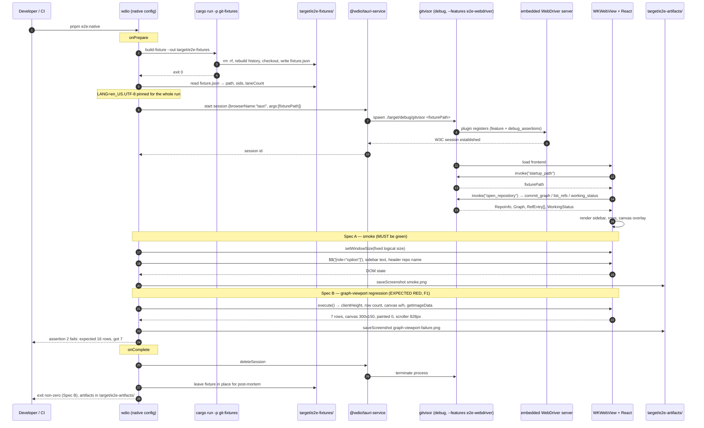

# Design: visual-verification-harness

The harness is **one artifact under test** — the real `gitvisor` binary in the real webview — driven by
WebdriverIO through an embedded WebDriver server that is **compiled out of every build that is not an e2e
build**. Everything else in this document exists to make that sentence structurally true rather than
documented: a Cargo feature that gates the dependency, a build-script switch that gates the matching
capability file, a `compile_error!` that makes the unsafe combination unbuildable, and a release gate that
inspects the shipped bytes and can prove it is still able to fail.

Scope reminder: this change **ships the harness and proves it catches F1**. It does not fix F1 or F2.

---

## Decision summary

Read this table first. Everything below is the reasoning, the evidence, and the exact mechanism.

| # | Question | Decision | Confidence |
|---|---|---|---|
| D1 | How is the WebDriver plugin kept out of release builds? | Optional dependency behind Cargo feature `e2e-webdriver`, plus an unconditional `compile_error!` when the feature is on without `debug_assertions` | **Verified** — Cargo semantics, no exotic behaviour |
| D2 | How are capabilities made feature-conditional? | `build.rs` selects the capability glob via `tauri_build::Attributes::capabilities_path_pattern`, keyed on `CARGO_FEATURE_E2E_WEBDRIVER`. **Not** a `tauri.e2e.conf.json` overlay | **Verified against tauri-build 2.6.3 source** (citations in §1.2) |
| D3 | How is absence proven at release? | Three gates: per-push `cargo tree`, per-release **blocking** artifact string scan with a positive control, and provenance capture. Publish `needs:` the scan | **Verified mechanism**, scan robustness argued in §1.3 |
| D4 | Fixture builder | `tools/git-fixtures` workspace member, `git2` TreeBuilder (no index, no worktree for history), pinned signatures, OID map asserted by `cargo test`, emits a machine-readable `fixture.json` manifest | **Verified** for git2 API; two sub-points flagged unverified in §2.4 |
| D5 | How does the app get the fixture path? | `argv[1]` via the existing `startup_path` command, passed through `tauri:options.args`; documented fallback to `localStorage` seeding | **`args` support is UNVERIFIED** — fallback specified |
| D6 | Browser-mode mock generation | New `tools/git-fixtures` binary `dump-mocks`. **`crates/git-core/examples/dump.rs` is not touched** | **Verified** — departs from proposal §5.3's suggestion, §4.1 explains why |
| D7 | The red test | Spec B keeps truthful assertions; CI wraps it in an **expected-failure guard** that asserts non-zero exit *and* the exact message. Not bare `continue-on-error`, not a characterization test | Deliberate **amendment to proposal §5.5**, §5 justifies |
| D8 | `withGlobalTauri` | **Off.** No spec in this change needs it. Exact, verified enable path recorded for the change that does | **Verified** enable path (`TAURI_CONFIG` merge), decision is a judgement call |
| D9 | Linux WebKitGTK | Lands **disabled**. A `workflow_dispatch` probe decides. Fallback ladder: embedded provider → official `tauri-driver` → drop Linux | **Unproven by construction** — that is the point |
| D10 | Does `saveScreenshot` capture native chrome? | **No — webview only.** Resolved empirically from the spike artifact. The traffic-light inset is assertable in the DOM, not verifiable in pixels | **Verified** from `e2e/__screenshots__/native-welcome.png`, §7 |

---

## Architecture at a glance

### Component map

```
┌─ product (must not change) ─────────────────────────────────────────────┐
│  crates/git-core    pure domain: git2, graph layout, model types        │
│  src-tauri          7 thin commands → GitRepo                           │
│  src/               React 19 + zustand; api.ts is the only invoke() site │
└─────────────────────────────────────────────────────────────────────────┘
        ▲ reads only                        ▲ drives, never edits
        │                                   │
┌─ harness (all new) ─────────────────────────────────────────────────────┐
│  tools/git-fixtures        build-fixture  → target/e2e-fixtures/<name>/ │
│   (workspace member)       dump-mocks     → e2e/mocks/<name>.json       │
│                            tests/         → OID determinism assertions  │
│                                                                          │
│  e2e/native/*.spec.ts      real binary, real webview  (authority)       │
│  e2e/browser/*.spec.ts     Chrome + mocked invoke()   (fast loop)       │
│  e2e/support/*.ts          fixture manifest reader, artifact paths       │
│                                                                          │
│  wdio.shared.conf.ts + wdio.native.conf.ts + wdio.browser.conf.ts        │
│  .github/workflows/*.yml                                                 │
└─────────────────────────────────────────────────────────────────────────┘
        │ feature-gated, never in a release build
        ▼
┌─ build-time gates (src-tauri) ──────────────────────────────────────────┐
│  Cargo feature  e2e-webdriver → optional dep + compile_error! guard      │
│  build.rs       capability glob switch                                   │
│  capabilities/app/*   product ACL    capabilities/e2e/*   harness ACL    │
└─────────────────────────────────────────────────────────────────────────┘
```

### Boundary compliance (`rules.design`)

| Rule | How this design honours it |
|---|---|
| Domain logic stays in `git-core` | The harness adds **zero** lines to `crates/git-core`. Not one file, not `examples/dump.rs`. See §4.1 |
| `src-tauri` only exposes thin commands | No new command. The fixture path arrives through the **existing** `startup_path`; the browser fallback uses the **existing** `rememberedRepo()` localStorage key. Nothing is added to `commands.rs` |
| No Tauri/React imports in `git-core` | `tools/git-fixtures` depends on `git-core` and `git2`, never the reverse. `git-core` gains no dependency, dev or otherwise |
| Sequence diagram for complex flows | §3 |

The one new workspace member sits at `tools/`, not `crates/`, so the tree says "tooling, not product" without a
comment. It is depended on by nothing.

---

## 1. Release safety

### 1.1 The dependency gate (D1)

`src-tauri/Cargo.toml`:

```toml
[dependencies]
tauri-plugin-wdio-webdriver = { version = "1.3", optional = true }

[features]
e2e-webdriver = ["dep:tauri-plugin-wdio-webdriver"]
```

`src-tauri/src/lib.rs`:

```rust
// An embedded WebDriver server is a remote-control surface. This makes the
// unsafe combination unbuildable rather than merely discouraged.
#[cfg(all(feature = "e2e-webdriver", not(debug_assertions)))]
compile_error!(
    "feature `e2e-webdriver` embeds a WebDriver server and must never be enabled \
     in a build without debug_assertions. Build the e2e binary with `cargo build \
     -p gitvisor --features e2e-webdriver` (debug profile)."
);

#[cfg(all(feature = "e2e-webdriver", debug_assertions))]
let builder = builder.plugin(tauri_plugin_wdio_webdriver::init());
```

**Why `compile_error!` and not just the `cfg` gate.** The `cfg(all(...))` on the registration already prevents
the server starting, but it fails *silently and successfully* — the exact failure shape this project has been
bitten by. `compile_error!` converts `--release --features e2e-webdriver` from "a binary that links a
WebDriver server but never starts it" into "a build that does not exist". The registration keeps the double
gate as defence in depth; with `compile_error!` present it is belt-and-braces, and that is fine.

**Ruled out, with the reason, so nobody retries them:**

| Mechanism | Why not |
|---|---|
| `[target.'cfg(debug_assertions)'.dependencies]` | **Measured this session:** Cargo emits `warning: Found 'debug_assertions' in target.'cfg(...)'.dependencies. This value is not supported for selecting dependencies and will not work as expected` — and then **compiles successfully with the dependency linked**. A warning in a wall of build output is not a gate |
| `[dev-dependencies]` | Available to tests/examples/benches. The artifact under test is the real binary, which does not see them |
| Registration-only `cfg(debug_assertions)` | Current spike state. The crate still links into release. This is what the change fixes |

### 1.2 The capability gate (D2) — open question 1, resolved

The proposal named a `tauri.e2e.conf.json` overlay on `app.security.capabilities` as a *leading candidate, not
confirmed*. **It is confirmed to be the wrong mechanism, for a reason the proposal could not have known.**

**What was checked** — the installed Tauri source in the local Cargo registry, not documentation:

| Fact | Evidence |
|---|---|
| `app.security.capabilities` is `Vec<CapabilityEntry>`; **empty means "all files from `./capabilities/`"**; non-empty selects by identifier or inlines | `tauri-utils-2.9.3/src/config.rs:2931-2954`; `tauri-utils-2.9.3/src/acl/mod.rs:353-376` |
| **`validate_capabilities` runs over every file matched by the capability glob — not over the selected subset** — and `anyhow::bail!`s on an unknown permission | `tauri-build-2.6.3/src/acl.rs:337-398`, called unconditionally at `:430` with the full parse result from `:424-429` |
| The glob is overridable: `Attributes::capabilities_path_pattern(&'static str)` | `tauri-build-2.6.3/src/lib.rs:356, 376-387` |
| `TAURI_CONFIG` env var is merged into the config by both build and codegen, via `json_patch::merge` (RFC 7386: objects merge, **arrays replace wholesale**) | `tauri-build-2.6.3/src/lib.rs:487-490`; `tauri-codegen-2.6.3/src/lib.rs:83-87`; `tauri-utils-2.9.3/src/acl/build.rs:427-430` |

**The consequence that kills the overlay approach:** a file `src-tauri/capabilities/e2e.json` containing
`"wdio-webdriver:default"` **breaks the ordinary `cargo build`**, whether or not the config selects it. Without
the feature, the plugin contributes no ACL manifest, so `validate_capabilities` cannot find the permission and
bails with `Permission wdio-webdriver:default not found, expected one of ...`. Selection happens *after*
validation. An overlay that only changes `app.security.capabilities` cannot rescue this.

**Decision: gate the glob in `build.rs`, keyed on the same Cargo feature.**

```rust
// src-tauri/build.rs
fn main() {
    // Attributes::capabilities_path_pattern suppresses tauri-build's own
    // rerun-if-changed for the capabilities directory, so emit it here.
    println!("cargo:rerun-if-changed=capabilities");

    let pattern = if std::env::var_os("CARGO_FEATURE_E2E_WEBDRIVER").is_some() {
        "./capabilities/**/*"          // product ACL + harness ACL
    } else {
        "./capabilities/app/**/*"      // product ACL only
    };

    tauri_build::try_build(tauri_build::Attributes::new().capabilities_path_pattern(pattern))
        .expect("failed to run tauri-build");
}
```

Layout:

```
src-tauri/capabilities/
  app/default.json    identifier "default"  → core:default, dialog:allow-open
  e2e/e2e.json        identifier "e2e"      → core:window:default, wdio-webdriver:default
```

`app.security.capabilities` stays **absent** from `tauri.conf.json` (empty ⇒ "everything the glob found"), so
there is no second list to keep in sync with the filesystem.

Why this beats the overlay, beyond the validation problem:

1. **One switch, not two.** The Cargo feature controls the dependency *and* the ACL. You cannot get a binary
   with the plugin but no permission, or a permission with no plugin.
2. **No `--config` flag to remember.** The e2e build is plain `cargo build -p gitvisor --features
   e2e-webdriver`. Forgetting a CLI flag is a live failure mode; there is no flag.
3. `CARGO_FEATURE_<NAME>` is documented Cargo build-script behaviour. `cfg(feature = ...)` in `build.rs` would
   also work, but the env-var form is the one Cargo's reference guarantees, so it is the one used here.

**What changes in the tree:** `capabilities/default.json` moves to `capabilities/app/default.json` and loses
`core:window:default` and `wdio-webdriver:default`; both land in the new `capabilities/e2e/e2e.json`.
`core:window:default` is harness-only surface — no file under `src/` imports `@tauri-apps/api/window`.

**Caveat, stated as such:** `capabilities_path_pattern`'s doc comment warns *"The `removeUnusedCommands` option
does not work with a custom capabilities path"* (`tauri-build-2.6.3/src/lib.rs:378`). This project does not use
`removeUnusedCommands`. If it is ever adopted, this decision must be revisited.

**Residual unverified point:** that a default `cargo build` succeeds with `capabilities/e2e/e2e.json` present
on disk is a code-reading conclusion, not an executed build. It is cheap to confirm and must be the first thing
the apply phase runs.

### 1.3 The release gate (D3) — **deviation from proposal §5.3, applied deliberately**

> **Deviation notice.** Proposal §5.3's CI table marks the release-tag row **non-blocking**, and that row
> carries the artifact scan from §5.1. As written, a release tag could be cut with the plugin embedded and CI
> would stay green, because the only check that inspects the shipped bytes cannot fail the pipeline. This
> design **overrides that row: the artifact scan is blocking on release tags, and publication depends on it.**
> Everything else in §5.3 stands. Recorded here rather than silently changed.

Three independent gates, each answering a different question:

| Gate | Question it answers | Trigger | Blocking |
|---|---|---|---|
| **G1 — build graph** | Is the crate in the dependency graph? | Every push/PR | **Yes** |
| **G2 — artifact scan** | Is the plugin in the bytes we are about to publish? | Release tag | **Yes — publish `needs:` it** |
| **G3 — provenance** | Was the scanned artifact the published artifact? | Release tag | **Yes** |

**G1 — build graph.** Seconds, no GUI dependencies:

```
cargo tree -p gitvisor -e normal --release            → MUST NOT contain tauri-plugin-wdio-webdriver
cargo tree -p gitvisor -e normal --features e2e-webdriver → MUST contain it
```

Both directions in one script. The positive assertion is what makes the negative one mean anything: a `grep`
that has silently stopped matching looks identical to a `grep` that legitimately found nothing.

**G2 — artifact scan.** What it inspects, precisely:

- **Target:** every Mach-O file under `Gitvisor.app/Contents/`, not just `Contents/MacOS/gitvisor`.
  Scanning only the main binary would miss a helper or a bundled framework.
- **Primary probe — embedded strings.** `strings -a` (or `rg -a --binary`) for the plugin's IPC identifier
  `wdio-webdriver`. Tauri routes plugin IPC as `plugin:<name>|<command>`, and `<name>` is a `&'static str`
  compiled into `__TEXT,__cstring`. **String literals survive `strip`**, which removes the symbol table, not
  the text section. This is why the string probe is primary and the symbol probe is corroborating.
- **Corroborating probe — symbol table.** `nm -aU` (or `llvm-nm`) for `tauri_plugin_wdio_webdriver`. Recorded,
  but **never** used alone to conclude absence: a stripped release binary yields no symbols, so "no match"
  would prove nothing. The script must treat an empty symbol table as *uninformative*, not as *clean*.
- **Frontend probe.** The same string scan runs over `Contents/Resources` (the bundled `dist/`), which catches
  a `@wdio/*` devDependency accidentally imported from `src/` and bundled.

**How it avoids manufacturing confidence — the positive control is mandatory, not optional.** The same script,
in the same job, on the same runner, scans a deliberately-built `--features e2e-webdriver` artifact and
requires it to report **PRESENT**. Three outcomes only:

| release artifact | e2e artifact | Result |
|---|---|---|
| absent | present | **pass** |
| present | present | **fail** — the plugin shipped |
| absent | absent | **fail — the scan is broken**, exit with `scan produced no match on a known-positive artifact` |
| present | absent | **fail** — inverted/nonsensical, treat as broken |

The third row is the one that matters. Without it, a scan whose pattern went stale reads as a permanent pass —
the same shape as the `cfg(debug_assertions)` warning problem: a mechanism that looks rigorous and cannot fail.

**False positives.** The only way `wdio-webdriver` appears in a release Mach-O is if the crate is in the graph
(panic-location strings, the plugin name literal, or the registry path). That is precisely the condition being
detected, so a "false" positive here is a true positive. If a benign match is ever found, the fix is to narrow
the probe *and re-prove the positive control*, never to add an exclusion and move on.

**G3 — provenance and wiring.** The artifact scanned must be the artifact published:

- The build job uploads the `.app`/bundle **and** `cargo tree -e normal --release` output as artifacts, plus a
  `sha256` of every scanned Mach-O.
- The scan job downloads that artifact — it does not rebuild — and re-hashes before scanning.
- The publish/upload-to-release job declares `needs: [scan]`. GitHub Actions skips a job whose `needs`
  dependency failed, so a failed scan **cannot** be followed by a publish. `continue-on-error` MUST NOT appear
  on the build, scan, or publish jobs.

### 1.4 Where the harness must add nothing

`tauri.conf.json` gains **no** field. Not `withGlobalTauri` (§6), not `app.security.capabilities`, not a
plugin entry. The shipped configuration is byte-identical to today's apart from nothing at all; only the
capability *files* move, and the file that moves out of the product set is the one that was widening its ACL.

---

## 2. Deterministic fixtures (D4)

### 2.1 Crate shape

```
tools/git-fixtures/
  Cargo.toml            name = "git-fixtures", publish = false
  src/lib.rs            FixtureSpec, build(), Manifest
  src/spec.rs           the graph shape, as data
  src/bin/build-fixture.rs
  src/bin/dump-mocks.rs
  tests/determinism.rs
```

Dependencies: `git2.workspace = true`, `git-core = { path = "../../crates/git-core" }` (used only by
`dump-mocks`), `serde` + `serde_json`. Workspace member, so `cargo clippy --workspace --all-targets` and
`cargo fmt --all --check` cover it without a new command. Nothing depends on it.

### 2.2 How determinism is achieved — the mechanism, not the intention

The fixture history is built **without an index and without a worktree**, which removes the largest class of
ambient leaks:

| Pinned | How |
|---|---|
| Author + committer time and offset | `git2::Signature::new(name, email, &git2::Time::new(EPOCH + n*60, 0))` — literal epoch, offset `0` |
| Author + committer identity | Literals in `spec.rs`. Never `Repository::signature()`, which reads ambient `user.name`/`user.email` |
| Default branch | `Repository::init_opts` with `RepositoryInitOptions::initial_head("main")` — immune to `init.defaultBranch` |
| File bytes | `repo.blob(b"...")` with literal `&[u8]`, LF only |
| Trees | `repo.treebuilder()` + `insert(path, oid, 0o100644)`. **No `index.add_path`, no checkout during history construction** — so `core.autocrlf`, `core.fileMode`, and `.gitattributes` cannot participate |
| Graph shape | Explicit parent lists in `spec.rs` |
| Annotated tag | `repo.tag()` with a pinned tagger signature — the tagger is part of the tag OID |

Optional hardening, flagged because it is `unsafe` and process-global: `git2::opts::set_search_path` can point
the global/system/XDG config search paths at an empty directory, making ambient config unreadable rather than
merely unused. Recommended for the `cargo test`, optional for the binary.

**Working-directory dirt is built separately, after the history.** `working_status` needs a real checkout:
`set_head("refs/heads/main")` → `checkout_head(force)` → write two literal files (one staged via the index, one
modified-unstaged). This step **cannot affect commit OIDs**, which is why it is sequenced after the assertion
boundary and excluded from the determinism test's subject.

### 2.3 How OIDs are asserted

`tools/git-fixtures/tests/determinism.rs`:

- Builds the fixture into a scratch directory under `target/`, distinct from the runtime output path.
- Asserts a **full alias → OID map**, not just `HEAD`: every commit by its spec alias, the annotated tag OID,
  and `HEAD`'s tree OID. Asserting only `HEAD` tells you *that* something drifted; asserting the map tells you
  *which commit* did, which is the difference between a two-minute fix and an afternoon.
- Constants live in `src/oids.rs` as `pub const`s so the builder and the test share one definition.
- The failure message prints expected/actual side by side for the first mismatching alias.

This is the property `explore.md` could not get from a `git fast-import` stream without shelling out to the
`git` CLI — which would reintroduce the ambient dependency being eliminated.

### 2.4 Materialisation, and how specs find it

`build-fixture` writes to `target/e2e-fixtures/<name>/` — already covered by the existing `.gitignore` entry
`target/`. The directory is **removed and rebuilt** on every run; determinism makes that free.

Alongside the repository it writes `target/e2e-fixtures/<name>/fixture.json`:

```jsonc
{
  "name": "history",
  "path": "/abs/path/to/target/e2e-fixtures/history",
  "headOid": "…",
  "commitCount": 16,
  "laneCount": 4,                       // from git-core's real layout, not guessed
  "rowHeight": 28,                      // mirrored from src/features/graph/layout.ts
  "commits": [{ "alias": "m6", "oid": "…", "shortId": "…", "summary": "…", "lane": 0 }],
  "branches": ["chore/deps", "feature-a", "feature-b", "main", "refactor/parser"],
  "remotes": ["origin/main", "origin/feature-a"],
  "tags": ["v0.1.0"]
}
```

The manifest is the **single seam between Rust and TypeScript**. No OID, branch name, or row count is
hardcoded in a `.spec.ts` file; `e2e/support/fixture.ts` reads the manifest. This is why the fixture can change
shape later without editing assertions.

**Fixture graph shape** (proposal open question 4) — 16 commits chosen to exercise `git-core`'s lane
allocator, all within `product_scope.in_scope`:

- a linear root run (lane reuse),
- two branches diverging from the same commit and both surviving to the tip (lane allocation under contention),
- one branch that diverges and **reconverges** via a merge commit (lane release),
- one long edge spanning more than the short-edge window, so `indexLongEdges` is exercised,
- an annotated tag on a **non-tip** commit,
- a remote-tracking ref ahead of its local branch (tracking counts),
- one merge with three parents is **excluded** — octopus merges are not in the product's daily path and add
  layout risk for no coverage gain.

No rebase, cherry-pick, or force-push shapes. Per proposal §3, the fixture must not normalise a deferred
capability into the suite.

**How the path reaches the app (D5).** The app already accepts a repository path as `argv[1]` through the
existing `startup_path` command. Preferred wiring:

```ts
capabilities: [{
  browserName: "tauri",
  "tauri:options": { application: "./target/debug/gitvisor", args: [fixturePath] },
}]
```

**`tauri:options.args` support in `@wdio/tauri-service` 1.3.0 is UNVERIFIED.** The spike passed no arguments.
Fallback, in order, both using existing product code paths and neither requiring a change to `commands.rs`:

1. `args` on the capability (preferred — exercises `startup_path`, the real code path a user hits with
   `gitvisor .`).
2. Seed the existing `localStorage` key before load: `browser.execute(() =>
   localStorage.setItem("gitvisor:last-repo", path))` then reload, hitting `rememberedRepo()` in
   `src/features/repo/store.ts`.

**Explicitly rejected:** teaching `startup_path` to read an environment variable. That would be a product
change made for the harness's convenience, which is exactly what §3 of the proposal forbids.

---

## 3. The native E2E run

### Sequence



### Integration points

| Seam | Direction | Contract |
|---|---|---|
| `startup_path` / `argv[1]` | harness → app | Existing command. Harness passes an absolute path; nothing changes in `commands.rs` |
| `localStorage["gitvisor:last-repo"]` | harness → app | Existing key from `store.ts`. Fallback path only |
| `[role="listbox"][aria-label="Commit history"]` | app → harness | Existing ARIA in `CommitGraph.tsx`. **Not added for the harness** |
| `[role="option"]` rows | app → harness | Existing, from `CommitRow.tsx` |
| `canvas` in the graph pane | app → harness | Existing; `aria-hidden`, so selected by tag within the pane |
| `fixture.json` | Rust → TS | New. The only Rust↔TS data contract in the harness |
| `e2e/mocks/*.json` | Rust → browser mode | New. Generated, diffed, never hand-edited |

**No product selector is added for testability in this change.** Every assertion targets ARIA or structure that
already exists. If a future spec needs a hook that does not exist, adding it is a product change and belongs in
its own proposal.

---

## 4. Browser mode

### 4.1 Mock generation (D6) — open question 7, resolved

**`crates/git-core/examples/dump.rs` is not modified.** The proposal suggested reusing it; design declines, for
three reasons:

1. **It is a documented command.** `openspec/config.yaml` lists `cargo run -p git-core --example dump -- <repo>`
   under `reference_commands`. Its ASCII output is a human debugging aid. Changing it to JSON breaks a
   documented workflow to save writing one file.
2. **It would put the wrong vocabulary in the wrong crate.** The mock payloads are keyed by *Tauri command
   name* — `open_repository`, `commit_graph`, `commit_detail`, `list_refs`, `working_status`. That mapping is
   `src-tauri`'s vocabulary, not the domain's. Putting it in a `git-core` example does not violate the letter
   of "no Tauri/React imports in `git-core`", but it drags the shell's naming into the domain crate for no
   reason. `explore.md`'s final sections are explicit that `git-core` stays transport-agnostic.
3. **A better home already exists in this change.** `tools/git-fixtures` is already a workspace member, already
   depends on `git2`, is already labelled tooling, and already knows the fixture.

So: a second binary, `tools/git-fixtures/src/bin/dump-mocks.rs`.

```
cargo run -p git-fixtures --bin dump-mocks -- \
  --repo target/e2e-fixtures/history --out e2e/mocks/history.json
```

It opens the fixture through `git_core::GitRepo` — the *same* type `src-tauri/src/commands.rs` calls — and
serialises the *same* model structs. Every type in `crates/git-core/src/model.rs` derives `Serialize` with
`#[serde(rename_all = "camelCase")]`, so the JSON is byte-for-byte what the frontend receives over IPC. There
is no second serialization surface and nothing to keep in sync; the compiler owns the shape.

Output shape:

```jsonc
{
  "startup_path": "{{FIXTURE_PATH}}",
  "open_repository": { "path": "{{FIXTURE_PATH}}", "name": "history", "head": { … } },
  "commit_graph":   { "rows": [ … ], "laneCount": 4, "truncated": false },
  "list_refs":      [ … ],
  "working_status": { … },
  "commit_detail":  { "<oid>": { … } }
}
```

**Path normalisation is mandatory, not cosmetic.** `RepoInfo.path` is an absolute path that differs per
machine, so a raw dump would make the CI diff fail on every run and train everyone to ignore it. `dump-mocks`
replaces the fixture root with the literal token `{{FIXTURE_PATH}}`; `e2e/support/mocks.ts` substitutes a
browser-safe value on load. Commit timestamps are already deterministic because the signatures are pinned.

**Committed and diffed.** `e2e/mocks/*.json` is **committed**, which is what makes drift detectable and lets
the browser job run on `ubuntu-latest` with no Rust and no webkit. Two separate CI jobs:

| Job | Needs Rust | Needs webkit | Blocking |
|---|---|---|---|
| `browser-e2e` — runs specs against committed mocks | no | no | yes |
| `mocks-drift` — regenerates and `git diff --exit-code e2e/mocks` | yes | no | yes |

A drifted payload fails as a diff, which is proposal §5.3's requirement met exactly.

### 4.2 What browser mode is and is not

Fast iteration loop, not the correctness authority. It cannot see WebKit rendering, real IPC, the capability
system, or the titlebar inset. Native mode is the authority. This is restated here because a green browser run
is the easiest thing in this change to oversell.

---

## 5. The red test (D7) — open question 5, resolved

### Spec B keeps truthful assertions; the inversion lives in CI

**Rejected — bare `continue-on-error: true` on the native job (proposal §5.5).** The mechanism is right in
spirit but too coarse. Applied at job level, a *broken harness* — a launch failure, a bad selector, a missing
fixture — is indistinguishable from the expected defect, and both are swallowed. That is the failure mode
proposal §5.5 itself warns about one paragraph earlier ("a red test that is red for an uninteresting reason
proves nothing"), reintroduced by the CI wiring.

**Rejected — a characterization test asserting the defect still exists.** It keeps CI green, which is genuinely
valuable, but it pays for that with a worse problem: the suite would report `✓ graph-viewport: renders 7 rows`,
and a green checkmark next to an encoded bug reads as *this is fine* to every future reader. It also destroys
this change's own acceptance criterion — proposal §5.5 requires the captured failing output
(`expected 16 rows, got 7`) as the evidence the change is done, and a characterization test never produces it.
And it inverts the signal for `fix-graph-viewport`: fixing the bug would *break* the test, so the follow-up
change's first act would be deleting assertions, which is the wrong instinct to institutionalise.

**Chosen — an expected-failure guard at the CI step level.** Spec B is written as the real regression test,
with the assertions exactly as proposal §5.5 specifies, un-inverted. CI wraps *only that spec's step*:

```yaml
- name: Spec A — native smoke (must be green)
  run: pnpm e2e:native:smoke            # blocking, no continue-on-error

- name: Spec B — graph-viewport regression (EXPECTED RED until fix-graph-viewport)
  run: ./scripts/expect-red.sh pnpm e2e:native:regressions "expected 16 rows, got 7"
```

`scripts/expect-red.sh` passes only when **both** hold:

1. the wrapped command exits **non-zero**, and
2. its output contains the expected assertion message.

Failure modes and what they report:

| Situation | Guard result | Message |
|---|---|---|
| F1 still present, assertion 2 fails | **pass** | expected failure confirmed |
| Spec B passes | **fail** | `Spec B passed — F1 appears fixed. Remove the guard and this step's wrapper (fix-graph-viewport).` |
| Spec B fails on a launch error/timeout/selector | **fail** | `Spec B failed for the wrong reason; expected message not found` |
| The message wording drifts | **fail** | same as above — the guard fails closed |

Why this is the right shape:

- **CI is green, so red is never normalised**, and Spec A remains a genuine blocking gate in the same job, so a
  broken harness still fails the build.
- **The test file never lies.** The only thing that encodes "this is currently broken" is one CI step and one
  9-line script, both named after the change that deletes them.
- **`fix-graph-viewport` is forced to act.** The moment F1 is fixed, the guard fails with an instruction. Its
  acceptance criterion becomes "delete `expect-red.sh` and unwrap the step", which is a *deletion*, not an
  assertion rewrite.
- **It mirrors §1.3's reasoning.** Asserting both directions — that the failure happens *and* that it is the
  expected failure — is the same discipline that makes the artifact scan meaningful. A guard that could pass
  because its pattern went stale would be the same defect this project keeps hitting; this one fails closed.

Deviation from proposal §5.5 is limited to the mechanism. The requirement — Spec B red for the right reason,
the captured message as the change's evidence, `fix-graph-viewport` named as the owner — is preserved in full.

### Spec B assertion precision

Two details the proposal's formula leaves implicit, both of which would cause a false red:

- **Use the fractional height.** `viewportHeight` comes from `ResizeObserver`'s `contentRect.height`, which can
  be fractional. Recomputing the expectation from the integer `clientHeight` can shift `Math.ceil` by a whole
  row. Assertion 3 MUST derive its expectation from `getBoundingClientRect().height`, the same fractional value
  React receives. The scroller has no padding or border, so the two agree modulo rounding.
- **Canvas dimensions come from the manifest.** Assertion 4's expected width is
  `Math.round(graphWidth(laneCount) * devicePixelRatio)` with `graphWidth = min(28 + (laneCount-1)*15, 260)`
  from `src/features/graph/layout.ts`, and `laneCount` read from `fixture.json` — not hardcoded.
- **Assertion 5's probe coordinate** is `laneX(lane) = 14 + lane*15`, `rowY(0) = 14`, scaled by
  `devicePixelRatio`, with `lane` read from the manifest's row 0. A tolerance window of ±`NODE_RADIUS` (4.5px,
  scaled) around that point avoids depending on exact antialiasing.

---

## 6. `withGlobalTauri` (D8) — finding H1, resolved

**Decision: leave it off. Accept the warnings.**

Reasoning:

1. **No spec in this change needs it.** Spec A asserts DOM text and structure; Spec B asserts DOM geometry and
   canvas pixels. Both are reachable through the ordinary WebDriver session, proven by the spike
   (`1 passing in 8.4s` with the warnings present). Log forwarding and window-state assertions are
   nice-to-haves with no consumer.
2. **It would widen the difference between the e2e binary and the debug binary.** Today the e2e build differs
   from a normal debug build in exactly one dimension: the feature flag. Adding `withGlobalTauri` makes it two,
   and one of them changes the page's global object graph. Small, but the whole argument for native mode is
   fidelity to what actually runs.
3. **It costs a mechanism.** §1.2 deliberately removed the need for any config overlay. Enabling
   `withGlobalTauri` reintroduces one.

**The enable path, recorded so the next change does not re-derive it.** It is verified, and it does *not*
require the Tauri CLI:

```
TAURI_CONFIG='{"app":{"withGlobalTauri":true}}' \
  cargo build -p gitvisor --features e2e-webdriver
```

`TAURI_CONFIG` is merged by both `tauri-build` (`lib.rs:487-490`) and `tauri-codegen` (`lib.rs:83-87`) with
`json_patch::merge`. It is a build-time environment variable, so it never appears in the committed
`tauri.conf.json` and cannot leak into a release build produced without it.

**Two hard constraints if it is ever enabled:**

- `withGlobalTauri` MUST NOT be written into `src-tauri/tauri.conf.json`. Env var only, set by the e2e build
  script only.
- The change that enables it MUST extend the artifact scan's positive/negative pair to cover it, exactly as
  §1.3 does for the plugin. An unscoped global surface is the same class of problem as an unscoped plugin.

---

## 7. Does `saveScreenshot` capture native window chrome? (D10) — open question 3, resolved

**Answer: no. Webview surface only.** Resolved this session by reading the spike's own artifact rather than
speculating.

`e2e/__screenshots__/native-welcome.png` is 2880×1800 — exactly the configured 1440×900 window at
`devicePixelRatio` 2. With `titleBarStyle: "Overlay"` and `hiddenTitle: true`, the webview fills the entire
window, so that resolution alone is ambiguous between "window" and "webview". The top-left corner is not:

- The 78px `TITLEBAR_INSET` gap **is visible** — the header's content starts ~158 device px ≈ 79 CSS px from
  the left edge, matching `TITLEBAR_INSET` exactly.
- The macOS traffic-light buttons that macOS composites into that gap **are absent**. The region is flat
  background.

The gap the app reserves is captured; the OS chrome the gap exists *for* is not.

**Consequences, stated without overreach:**

| Claim | Status |
|---|---|
| The `TITLEBAR_INSET` branch selection (78 vs 12) is assertable | **Yes** — read `paddingLeft` from the header's computed style in the DOM |
| The reserved gap's measured width is assertable | **Yes** — same computed style |
| "78px is the right number against real traffic lights" is verifiable by this harness | **No.** Remains in proposal §6's uncovered list. It needs an OS-level screen capture, which `explore.md` already established is unusable unattended on macOS |

**Residual caveat, and the cheap confirmation.** The absence could in principle be explained by the window
being unfocused at capture time. Confirmation costs one assertion in Spec A: sample the pixel at device
coordinate (40, 40) — inside the traffic-light zone — and assert it equals the app's background colour
`#0d1117`. If a future service update starts compositing chrome, that assertion fails and tells us the
capability changed. Cheap, and it fails in the informative direction.

---

## 8. Linux WebKitGTK (D9) — open question 2, resolved as a plan, not a claim

**The Linux native job lands disabled.** It is committed with `workflow_dispatch`-only triggering, so it exists
and is reviewable but nothing depends on it. It is promoted to the PR-to-`main` trigger only by a follow-up
commit that cites the run URL of a passing probe.

**The probe:** `.github/workflows/e2e-native-linux-probe.yml`, manual trigger, `ubuntu-latest`, installing
`webkit2gtk-4.1`, `libsoup-3.0`, `javascriptcoregtk`, `librsvg2`, `libayatana-appindicator3`, plus `xvfb`. It
runs **Spec A only** and uploads the screenshot. Its question is narrow and answerable: *can the embedded
provider get a session and a screenshot under `xvfb`?*

**Fallback ladder, in order:**

| # | Path | Cost | Note |
|---|---|---|---|
| 1 | Embedded provider (`tauri-plugin-wdio-webdriver`) + `xvfb` | none beyond the probe | Preferred. Same code path as macOS |
| 2 | Official `tauri-driver` + `WebKitWebDriver` | a second driver stack in `wdio.native.conf.ts`, `driverProvider` set explicitly | **Linux *is* supported by the official driver** — `explore.md` verified that the macOS gap is macOS-specific. This is a real fallback, not a hope |
| 3 | Drop Linux native coverage | none | macOS nightly becomes the only native signal; browser mode remains the per-push signal. Add a row to proposal §6's "does not verify" table |

**Decision rule, fixed in advance so it is not renegotiated under pressure:** three probe attempts. If the
embedded provider cannot produce a session and a screenshot, go to path 2 with the same three-attempt budget.
If that fails, take path 3 and record the failure output in this change's folder. Path 2's extra maintenance
cost is real — two driver stacks for one platform — so if path 1 works, path 2 is never built.

**Until the probe passes, no Linux native job is blocking, and nothing in the repository claims Linux native
coverage exists.**

---

## 9. File layout

```
.github/workflows/
  ci.yml                          push/PR: cargo test, clippy, fmt, pnpm build,
                                  G1 build-graph gate, browser-e2e, mocks-drift
  e2e-native-macos.yml            nightly + workflow_dispatch: Spec A blocking,
                                  Spec B via expect-red guard
  e2e-native-linux-probe.yml      workflow_dispatch only, until §8's probe passes
  release.yml                     build → G2 scan (blocking) → publish (needs: scan)

scripts/
  expect-red.sh                   §5 guard. Deleted by fix-graph-viewport
  release-scan.sh                 §1.3 G2, with the mandatory positive control

e2e/
  native/smoke.spec.ts            Spec A — MUST be green
  native/regressions/graph-viewport.spec.ts   Spec B — expected red (F1)
  browser/welcome.spec.ts         browser-mode iteration loop
  support/fixture.ts              reads target/e2e-fixtures/<name>/fixture.json
  support/mocks.ts                loads e2e/mocks/*.json, substitutes {{FIXTURE_PATH}}
  support/artifacts.ts            screenshot paths under target/e2e-artifacts/
  mocks/history.json              generated by dump-mocks, committed, diffed in CI

wdio.shared.conf.ts               framework, reporters, LANG pinning, artifact dir
wdio.native.conf.ts               tauri capability, onPrepare fixture build
wdio.browser.conf.ts              chrome capability, invoke() mocking
tsconfig.wdio.json

tools/git-fixtures/               §2

src-tauri/
  build.rs                        §1.2 capability glob switch
  capabilities/app/default.json   product ACL (moved, narrowed)
  capabilities/e2e/e2e.json       harness ACL (new)
```

**Deleted:** `e2e/spike.spec.ts`, `e2e/__screenshots__/native-welcome.png`, and the `wdio.conf.ts` spike config
(replaced by the three-file split). `e2e/__screenshots__/` becomes an unused path; artifacts go to
`target/e2e-artifacts/`, already gitignored by the existing `target/` entry.

**`pnpm-workspace.yaml`** keeps `allowBuilds: { esbuild: true, edgedriver: false, geckodriver: false }`
unchanged — it is a pnpm build-script allowlist, and neither Edge nor Firefox is used by either mode.

**Locale** is pinned to `LANG=en_US.UTF-8` in `wdio.shared.conf.ts` so both modes inherit it, with the tradeoff
from proposal §5.6 restated in a comment: this is exactly why F2's class of defect is out of reach.

---

## 10. Unverified register

Everything in this document that is **not** backed by executed evidence or read source, collected so it cannot
hide in prose:

| # | Claim | Why it matters | Cheapest check |
|---|---|---|---|
| U1 | A default `cargo build` succeeds with `capabilities/e2e/e2e.json` on disk but outside the glob | If wrong, §1.2's whole mechanism fails | `cargo build -p gitvisor` after creating the file. First task of apply |
| U2 | `#[cfg]`-free `CARGO_FEATURE_E2E_WEBDRIVER` is visible to `build.rs` | If wrong, use `#[cfg(feature = …)]` instead | Print it from `build.rs` once |
| U3 | `tauri:options.args` passes argv to the app | Decides D5's primary path | One spec run asserting the header shows the fixture name |
| U4 | The embedded provider works on Linux under `xvfb` | Decides the Linux CI row | §8's probe |
| U5 | `strings` on a bundled release `.app` reliably surfaces Rust `&'static str` literals after `strip` | Decides whether G2's primary probe is sound | Run `release-scan.sh` against the e2e build — the mandatory positive control **is** this check |
| U6 | The traffic lights' absence in the spike PNG is a capture property, not a focus artefact | Decides D10 | §7's pixel assertion in Spec A |
| U7 | `saveScreenshot` resolution is stable across runs on a CI virtual display | Only affects artifact readability, not assertions | Observed in the first CI run |

Nothing in this list blocks starting. Every item has a check measured in minutes, and U1 and U3 should be
resolved before the corresponding code is written rather than after.

---

## 11. Deviations from the proposal

Recorded explicitly so review can audit them rather than discover them.

| Proposal | Design | Reason |
|---|---|---|
| §5.1: `tauri.e2e.conf.json` overlay on `app.security.capabilities` (named a leading candidate) | `build.rs` capability-glob switch | The overlay cannot work: `validate_capabilities` runs over all globbed files before selection (`tauri-build-2.6.3/src/acl.rs:424-430`). §1.2 |
| §5.3: release-tag row **non-blocking**, carrying the §5.1 artifact scan | Artifact scan **blocking**; publish `needs:` it | A non-blocking scan cannot prevent the outcome it exists to prevent. Correction applied at the coordinator's direction. §1.3 |
| §5.3: mocks generated by `crates/git-core/examples/dump.rs` | New `tools/git-fixtures` binary `dump-mocks`; `dump.rs` untouched | Keeps command-name vocabulary out of the domain crate and preserves a documented `reference_command`. §4.1 |
| §5.5: native job lands with `continue-on-error: true` | Per-step expected-failure guard; Spec A stays blocking | Job-level tolerance swallows harness breakage as well as the expected defect. §5 |
| §6: traffic-light verifiability "not yet known" | Resolved: not verifiable in pixels; the inset is assertable in the DOM | Read from the spike artifact. §7 |

Additions that the proposal left to design and that are new here, not overrides: the `compile_error!` guard
(§1.1), the `fixture.json` manifest as the single Rust↔TS seam (§2.4), `{{FIXTURE_PATH}}` normalisation in the
mocks (§4.1), and Spec B's fractional-height precision requirement (§5).

---

## 12. Next step

`sdd-tasks`, once the parallel `specs/` work lands. The first three tasks should be U1, U3, and the §8 probe —
they are the cheapest checks that can invalidate the most design.

The follow-up change `fix-graph-viewport` fixes F1 and F2; its acceptance criterion is the **deletion** of
`scripts/expect-red.sh` and the unwrapping of its CI step, with Spec B green and unchanged.

---

## Orchestrator verification (2026-08-18): U1 executed, D1/D2/D3 gates measured

§10 lists U1 — that the capability glob gate actually works — as **load-bearing and
unexecuted**, and §12 asks for it to be the first task of apply. It was executed
before `sdd-tasks`, because every downstream task rests on it. All results below
are measured on this machine, not read from source.

### Negative control — the failure §1.2 predicted

Harness capability placed *inside* the default glob, plugin not compiled in:

```
error: failed to run custom build command for `gitvisor`
  Permission wdio-webdriver:default not found, expected one of core:default, …
```

Confirmed. `validate_capabilities` runs over every file the glob matches, before
selection. **The `tauri.e2e.conf.json` overlay approach is dead in fact, not only
in source reading.**

### The mechanism §1.2 specifies

`src-tauri/capabilities/` split into `app/` (product) and `e2e/` (harness), with
`build.rs` switching `capabilities_path_pattern` on `CARGO_FEATURE_E2E_WEBDRIVER`:

| Test | Expected | Result |
|---|---|---|
| `cargo build` (no feature) | succeeds — harness capability outside the glob | ✅ Finished |
| `cargo build --features e2e-webdriver` | succeeds — glob widens, permission resolves | ✅ Finished |

### The release-safety gates

| Gate | Expected | Result |
|---|---|---|
| `cargo tree -e normal` | no `wdio` in the graph | ✅ 0 occurrences |
| `cargo tree -e normal --features e2e-webdriver` | `wdio` present | ✅ 1 — **the positive control can still detect** |
| `cargo check --release --features e2e-webdriver` | `compile_error!` fires | ✅ `e2e-webdriver embeds a WebDriver control server and must never be built in release` |

The third result is the one worth keeping: enabling the feature in release does
not merely warn, it **fails to compile**. Safety does not depend on anyone
remembering.

### Status changes

- **U1 → VERIFIED.** D1 and D2 are measured, not inferred. Remove from the
  unverified register.
- **D3's per-push `cargo tree` gate → VERIFIED in both directions.** The
  release-*artifact* string scan (§1.3) remains unexecuted; it needs a real
  release build.
- The working tree now contains the verified mechanism: optional dependency +
  `e2e-webdriver` feature, the double `cfg(all(feature, debug_assertions))` gate,
  the `compile_error!` guard, `capabilities/{app,e2e}/`, and the `build.rs`
  glob switch. **`sdd-tasks` should treat these as implemented-and-verified and
  scope its tasks to re-verifying them in CI**, not to writing them from scratch.

### Still unverified

The §1.3 artifact scan (unexecuted; needs a real release build — deferred to
Phase 6). Note that the E2E run now requires `--features e2e-webdriver` to
build the binary under test — `wdio.conf.ts` points at `./target/debug/gitvisor`,
which no longer embeds the driver by default.

## U3 resolution (2026-08-18, apply phase Phase 1): `tauri:options.args` does NOT work

D5's "preferred" path — `capabilities: [{ "tauri:options": { application, args:
[fixturePath] } }]` — was tested empirically against `@wdio/tauri-service`
1.3.0's actual embedded-provider spawn path, not inferred from source reading
alone, per the coordinator's instruction.

**First measurement was contaminated and had to be redone.** A run with `args`
set landed on the main view with header text `"fixture"` — looked like a pass.
Investigation found `~/Library/WebKit/gitvisor/WebsiteData/…/localstorage.sqlite3`
already held a `gitvisor:last-repo` entry from an earlier manual verification
session (16:49 the same day), which `rememberedRepo()` (§ D5 fallback) picks up
independently of any argv. WebKit's local storage is keyed by the Tauri
bundle identifier and persists across process launches and wdio runs — it is
not reset by the test harness. **Every native-mode spec must account for
this**, not just this spike.

After `rm -rf ~/Library/WebKit/gitvisor/WebsiteData` (clean state) and
re-running:

| Capability shape | `[role="listbox"]` renders | Header text |
|---|---|---|
| `"tauri:options": { application, args: [FIXTURE_PATH] }` | **false** | `"Gitvisor"` (WelcomeScreen — startup_path returned nothing) |
| `"tauri:options": { application }`, `"wdio:tauriServiceOptions": { appArgs: [FIXTURE_PATH] }` | **true** | `"spike-fixture"` (exact fixture directory name) |

**Root cause, read from `@wdio/tauri-service@1.3.0`'s bundled
`dist/esm/index.js`.** The embedded-provider spawn path
(`startEmbeddedDriver`, called from the single-capability loop around line
2278) builds its process args from `options.appArgs`, where `options` comes
from `mergeOptions(this.options, cap['wdio:tauriServiceOptions'])` —
`cap['tauri:options']` is never consulted for args in that merge.
`cap['tauri:options'].args` (i.e. `tauriOptions.args`, line 2026) is read
exactly once, only to be logged at debug level (`App args: …`) during
capability validation; it is dead as far as the actual `spawn()` call at
line ~1609 is concerned. This is a gap/naming mismatch in `@wdio/tauri-service`
1.3.0 itself, not a docs-vs-behaviour ambiguity — the field exists, is typed,
is validated, and is silently discarded.

**Decision: use `wdio:tauriServiceOptions.appArgs`, not `tauri:options.args`,
and not the `localStorage` fallback.** This still exercises the real
`startup_path` argv code path (D5's actual goal — "the real code path a user
hits with `gitvisor .`") with **zero product-code fallback**, so it is
strictly better than falling back to seeding `localStorage`. `wdio.native.conf.ts`
(Phase 3) uses this shape. The `localStorage` fallback documented in §2.4
is demoted from "fallback path" to "unused, kept as a documented escape
hatch if a future `@wdio/tauri-service` version changes this again."

**Consequence for every native spec, not just this one.** `onPrepare` or a
`beforeSession` hook MUST clear `~/Library/WebKit/gitvisor/WebsiteData`
(macOS) before each run, or `rememberedRepo()` will mask a real regression by
silently opening whatever repo a previous run (or a developer's manual `pnpm
app`) last had open. `wdio.native.conf.ts` does this in `onPrepare`, not
per-spec, so it runs once per suite invocation.
